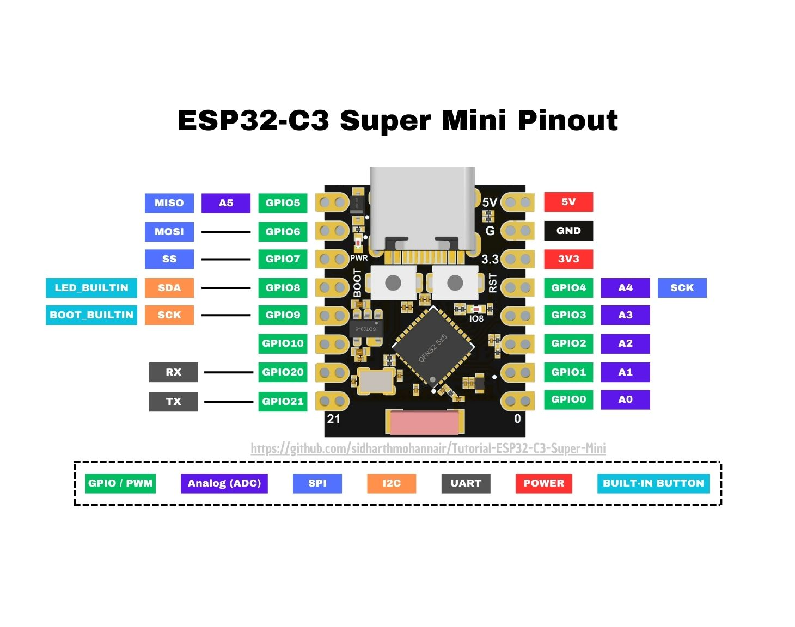
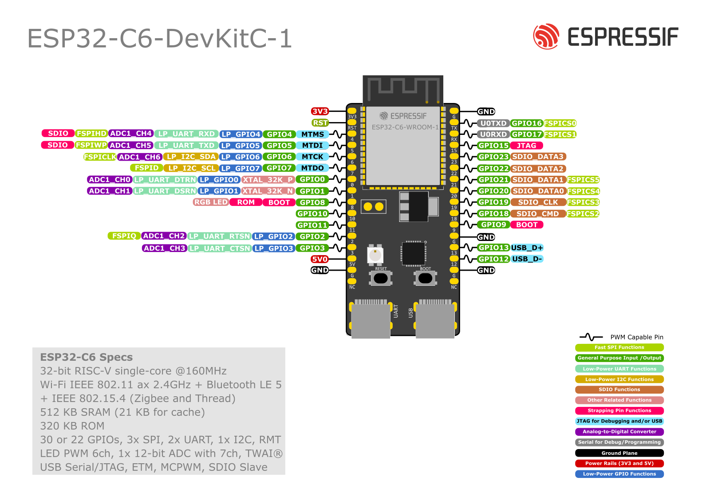
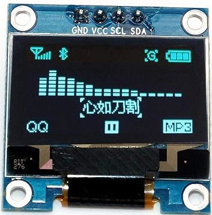
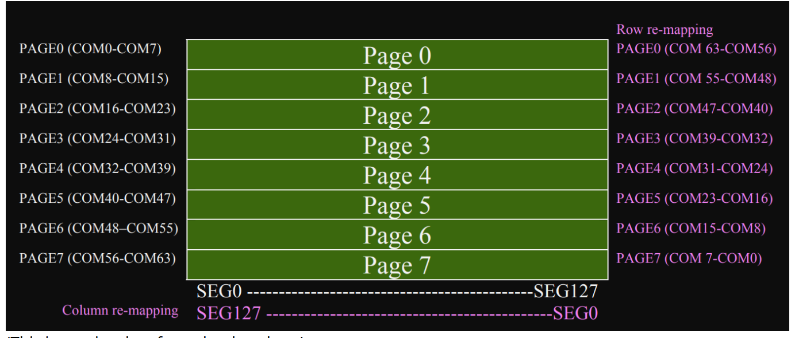
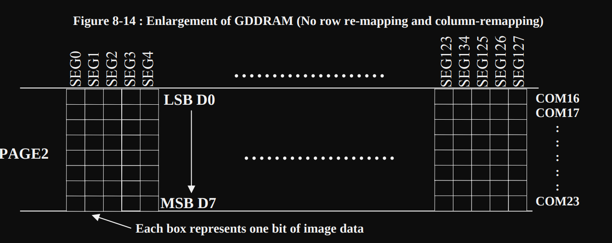
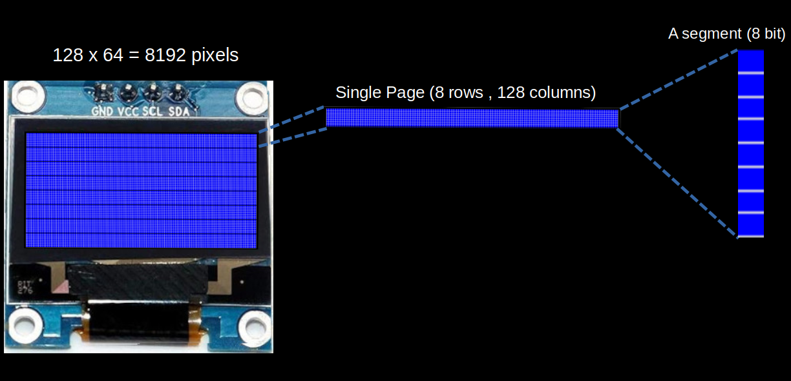
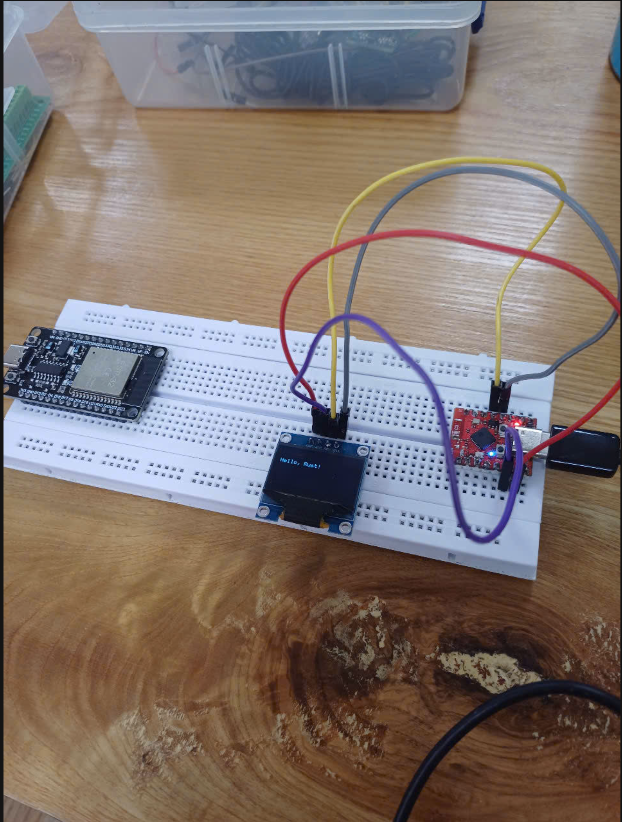
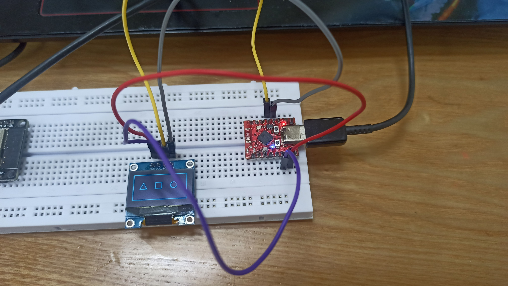
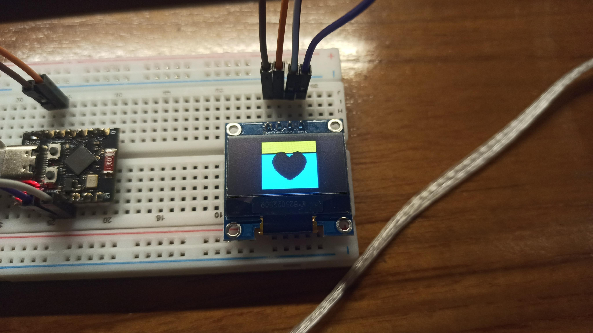

# Components (MCUs and Display Screen)
## ESP32C3 Supermini
### General Description
The ESP32-C3 Super Mini is a compact and versatile development board powered by the ESP32-C3 microcontroller. It offers robust Wi-Fi and Bluetooth Low Energy (BLE) connectivity, making it ideal for IoT, smart devices, and wireless sensor networks.

Key features include:

- Compact form factor with excellent GPIO access.
- RISC-V single-core processor for efficient performance.
- Comprehensive Wi-Fi and BLE 5.0 capabilities.

#### Board Specifications

| Feature           | Details                                                              |
|------------------|----------------------------------------------------------------------|
| **Microcontroller** | ESP32-C3 FN4 (RISC-V single-core processor @160 MHz)                |
| **Connectivity**     | Wi-Fi (2.4 GHz 802.11 b/g/n), BLE 5.0                              |
| **GPIO Pins**        | 10 Digital I/O, 2 Analog inputs                                    |
| **ADC**              | 6 channels of 12-bit SAR ADC                                       |
| **Flash Memory**     | 4MB                                                                 |
| **Power Supply**     | 5V via USB-C, onboard 3.3V regulator                               |
| **Operating Voltage**| 3.3V                                                                |
| **Dimensions**       | Ultra-compact, ideal for space-constrained applications           |

### Pinout



#### Pin Mappings

| Pin Name | GPIO    | Function                                      |
|----------|---------|-----------------------------------------------|
| 0        | GPIO0   | ADC1, PWM                                     |
| 1        | GPIO1   | ADC1, PWM                                     |
| 2        | GPIO2   | ADC1, Strapping Pin (Boot Mode)               |
| 3        | GPIO3   | ADC1, PWM                                     |
| 4        | GPIO4   | JTAG, ADC1                                    |
| 5        | GPIO5   | JTAG                                          |
| 8        | GPIO8   | Status LED (inverted), Strapping Pin          |
| 9        | GPIO9   | BOOT Button, Strapping Pin                    |
| 10       | GPIO10  | PWM                                           |
| 20       | GPIO20  | General-purpose I/O                           |
| 21       | GPIO21  | General-purpose I/O                           |

Key Notes:
- GPIO8: Connected to an inverted blue status LED.
- GPIO9: Connected to the BOOT button.
- JTAG Support: GPIO4–GPIO7 pins are reserved for debugging.

## ESP32-C6 Mini

The **ESP32-C6 Mini** is a compact development board based on the **ESP32-C6** microcontroller. It features a powerful 32-bit RISC-V single-core CPU with advanced wireless connectivity including Wi-Fi 6 and Bluetooth 5.0 LE, making it highly suitable for next-gen IoT applications, smart home devices, and secure edge computing.

Key features include:

- Ultra-compact form factor with extensive GPIO accessibility.
- Advanced wireless support with Wi-Fi 6 and BLE 5.
- 32-bit RISC-V architecture optimized for low-power and secure performance.

---

### Board Specifications

| Feature              | Details                                                                 |
|----------------------|-------------------------------------------------------------------------|
| **Microcontroller**  | ESP32-C6 (32-bit RISC-V single-core @160 MHz)                          |
| **Connectivity**     | Wi-Fi 6 (802.11ax), Bluetooth 5.0 LE, Zigbee, Thread (IEEE 802.15.4)    |
| **GPIO Pins**        | Up to 30 GPIOs, configurable for multiple functions                     |
| **ADC**              | 7 channels of 12-bit ADC (SAR)                                          |
| **Flash Memory**     | Varies by module (typically 4MB or more)                                |
| **Power Supply**     | 5V via USB-C, onboard 3.3V regulator                                    |
| **Operating Voltage**| 3.3V                                                                    |
| **Dimensions**       | Ultra-compact, ideal for embedded and space-constrained projects        |

---

### Pinout



#### Pin Mappings

| Pin Name | GPIO    | Function(s)                                                           |
|----------|---------|------------------------------------------------------------------------|
| 0        | GPIO0   | ADC1_CH0, LP_UART_DTR, LP_GPIO0, XTAL_32K_P                             |
| 1        | GPIO1   | ADC1_CH1, LP_UART_DSRN, LP_GPIO1, XTAL_32K_N                             |
| 2        | GPIO2   | ADC1_CH2, LP_UART_RTSN, LP_GPIO2                                        |
| 3        | GPIO3   | ADC1_CH3, LP_UART_CTSN, LP_GPIO3                                        |
| 4        | GPIO4   | LP_GPIO4, MTMS, ADC1_CH4                                                |
| 5        | GPIO5   | LP_GPIO5, MTDI, ADC1_CH5                                                |
| 6        | GPIO6   | LP_GPIO6, MTCK                                                          |
| 7        | GPIO7   | LP_GPIO7, MTDO                                                          |
| 8        | GPIO8   | RGB LED (inverted), Strapping Pin                                       |
| 9        | GPIO9   | BOOT Button, Strapping Pin                                              |
| 10       | GPIO10  | LP_GPIO10, PWM                                                          |
| 11       | GPIO11  | LP_GPIO11, General-purpose I/O                                          |
| 12       | GPIO12  | USB_D–                                                                  |
| 13       | GPIO13  | USB_D+                                                                  |
| 16       | GPIO16  | FSPI_CS0                                                                |
| 17       | GPIO17  | FSPI_CS1                                                                |
| 18       | GPIO18  | SDIO_CMD, FSPI_CS2                                                      |
| 19       | GPIO19  | SDIO_CLK, FSPI_CS3                                                      |
| 20       | GPIO20  | SDIO_DATA0, FSPI_CS4                                                    |
| 21       | GPIO21  | SDIO_DATA1, FSPI_CS5                                                    |
| 22       | GPIO22  | SDIO_DATA2                                                              |
| 23       | GPIO23  | SDIO_DATA3                                                              |

---

### Key Notes

- **GPIO8**: Connected to inverted RGB LED, can be used for status indication.
- **GPIO9**: BOOT button input, also a strapping pin.
- **GPIO4–GPIO7**: Reserved for JTAG debugging.
- **GPIO12 & GPIO13**: Act as native USB interface (USB-D– / USB-D+).
- **GPIOs 16–23**: Commonly used for high-speed SPI or SDIO functions.

## ESP32-C3 vs. ESP32-C6 Comparison

### 🔋 Power Consumption

| **Feature** | **ESP32-C3** | **ESP32-C6** |
|-------------|--------------|--------------|
| **Active Mode (CPU @ 160 MHz)** | ~130 mA (Wi-Fi active), ~20–25 mA (without RF) | Slightly higher: ~140–150 mA (advanced RF front-end) |
| **Modem Sleep** | ~2.4 mA (Wi-Fi connected but inactive) | ~2.5–3.0 mA |
| **Light Sleep** | ~0.8 mA (CPU halted, peripherals paused, RAM retained) | ~0.9–1.0 mA |
| **Deep Sleep** | ~5 µA (RAM retention, RTC active) | ~5–6 µA (RTC and ULP options) |
| **ULP Co-Processor** | ❌ Not available | ✅ Available (ultra-low-power sensing, e.g., temp, ADC) |
| **Dynamic Power Scaling** | ✅ Yes | ✅ Yes + finer control in new SDKs |
| **Voltage Range** | 3.0V–3.6V (3.3V typical) | 3.0V–3.6V |

**Conclusion**: Both boards are efficient, but ESP32-C6 offers more flexibility with its ULP co-processor and precise power management. ESP32-C3 is simpler and slightly more efficient for tight power budgets without ULP needs.

### 📡 Peripheral & Wireless Protocol Support

| **Feature** | **ESP32-C3** | **ESP32-C6** |
|-------------|--------------|--------------|
| **Wi-Fi** | 802.11 b/g/n (Wi-Fi 4, 2.4GHz only) | Wi-Fi 6 (802.11ax) with low-latency and power-efficient modes |
| **Bluetooth** | BLE 5.0 | BLE 5.0 LE with improved controller stack |
| **Zigbee** | ❌ Not supported | ✅ Supported (IEEE 802.15.4) |
| **Thread (Matter)** | ❌ Not supported | ✅ Supported (key for smart home/IoT) |
| **Security Hardware** | AES, SHA, RNG, Secure Boot, Flash Encryption | Same + HMAC, Digital Signature peripherals |
| **USB Support** | ❌ No native USB | ✅ Native USB Device support (GPIO12/13) |
| **PWM Channels** | 6 LEDC PWM channels | 8 or more PWM-capable GPIOs |
| **SPI Interfaces** | 2 SPI (1 HS, 1 general) | 3 SPI (FSPI, HSPI, optional Quad SPI flash) |
| **I2C Interfaces** | 2 (configurable via GPIO muxing) | 2 or more (configurable via GPIO muxing) |
| **UARTs** | 2 (1 default, 1 optional) | 3 total UARTs |
| **ADC Channels** | 6 x 12-bit SAR ADC | 7 x 12-bit SAR ADC |
| **DAC** | ❌ Not available | ❌ Not available |
| **I2S Audio** | ❌ Not supported | ✅ Supported in some SDK builds (check ESP-IDF) |
| **CAN Bus** | ❌ Not supported | ❌ Not supported |

**Conclusion**: ESP32-C6 is more capable for future-proof wireless communication (Matter, Zigbee, Thread) and supports native USB, ideal for HID/serial devices or firmware flashing.

### 📍 GPIO and Pin Functionality (I2C, SPI, UART)

#### ESP32-C3 I2C/SPI/UART Support
| **Protocol** | **Typical Pins** | **Notes** |
|--------------|------------------|-----------|
| **I2C** | GPIO8 (SDA), GPIO9 (SCL) | Can be re-mapped; often used with status LED and BOOT button |
| **SPI** | GPIO4–GPIO7 | SPI used for flash, so custom SPI must use alternate pins |
| **UART** | GPIO20 (TX), GPIO21 (RX) | UART0 used for programming and debug via USB-UART |

### ESP32-C6 I2C/SPI/UART Support
| **Protocol** | **Typical Pins** | **Notes** |
|--------------|------------------|-----------|
| **I2C** | Any GPIO via mux; e.g., GPIO1/2 or 10/11 | More flexible pin assignment with full GPIO matrix support |
| **SPI** | GPIO16–23 (FSPI/HSPI) | Supports higher speeds and SDIO/QSPI peripherals |
| **UART** | GPIO0–3, plus any free GPIO | 3 UARTs available; ideal for multi-sensor serial I/O |

**Conclusion**: ESP32-C6 offers superior GPIO flexibility and re-mapping, avoiding conflicts with bootstrapping or JTAG pins.

### 🔄 Async Programming Compatibility

| **Feature** | **ESP32-C3** | **ESP32-C6** |
|-------------|--------------|--------------|
| **ESP-IDF Async Support (C)** | Supported via esp_event, timers, tasks | Fully supported |
| **Rust Embassy Support (async/await)** | ✅ Supported via esp-hal and embassy-executor | ✅ Supported via esp-hal (early support improving) |
| **TinyGo Async Support** | Experimental | Experimental |
| **Micropython/Asyncio Support** | Supported | Supported |
| **Native USB Async** | ❌ | ✅ Fully supported (CDC, HID, USB serial) |

**Conclusion**: Both support async programming, but ESP32-C6’s native USB enables async USB communication, freeing UARTs and supporting device classes like HID, MIDI, etc.

### 🧠 Use-Case Recommendation

| **Project Type** | **Recommended Board** | **Reason** |
|------------------|-----------------------|------------|
| **Low-power sensor node (Wi-Fi/BLE)** | ESP32-C3 | Lower power, simpler setup, easier OTA and BLE support |
| **Matter/Zigbee Smart Home Device** | ESP32-C6 | Native support for 802.15.4, more future-proof |
| **Wearable or USB-powered Gadget** | ESP32-C6 | Native USB ideal for keyboards, gamepads, serial gadgets |
| **BLE Beacon or Tracker** | ESP32-C3 | Ultra-low power, BLE 5, great for small packet advertising |
| **Multi-sensor Gateway with Zigbee** | ESP32-C6 | Best for multiple wireless protocols |
| **Async Web Server (Rust/Embassy)** | ESP32-C6 | Faster memory bus, more RAM, better async GPIO/I/O |
| **Educational RISC-V IoT Projects** | ESP32-C3 | Easy to learn, stable, well-documented for beginners |
| **Advanced Prototyping (USB + Wi-Fi 6 + Thread)** | ESP32-C6 | Future-ready, multiprotocol, feature-packed |

### 🧾 Summary Table

| **Category** | **ESP32-C3 Super Mini** | **ESP32-C6 Mini** |
|--------------|-------------------------|-------------------|
| **Architecture** | RISC-V, 160 MHz, single-core | RISC-V, 160 MHz, single-core |
| **Wireless** | Wi-Fi 4, BLE 5.0 | Wi-Fi 6, BLE 5.0, Zigbee, Thread |
| **USB Support** | ❌ | ✅ Native USB device mode |
| **GPIO Count** | ~10 usable | ~30 fully muxed |
| **ADC Channels** | 6 channels | 7 channels |
| **ULP Co-Processor** | ❌ | ✅ Available (ultra-low power sampling) |
| **Async Compatibility** | ✅ Supported (Rust, ESP-IDF) | ✅ Supported + better USB support |
| **Power Efficiency** | Excellent | Excellent + finer control via ULP |
| **Dev Environment** | ESP-IDF, Rust (embassy), Arduino, Micropython | Same (Rust HAL support improving) |
| **Ideal For** | BLE/Wi-Fi IoT, budget designs | Complex IoT devices, Matter/Zigbee, USB devices |

### ✅ Final Verdict

**Choose ESP32-C3 if you**:
- Need low-cost, low-power Wi-Fi/BLE combo.
- Are building simple sensor nodes or BLE beacons.
- Prefer a stable and minimal toolchain (Rust, Arduino, etc.).

**Choose ESP32-C6 if you**:
- Need USB support or plan to use Matter, Zigbee, or Thread.
- Want to build future-ready smart home or edge devices.
- Require more GPIOs or high-speed interfaces like QSPI/SDIO.
- Want to combine Wi-Fi 6 and async USB communications in Rust or C.

## SSD1306 
- The SSD1306 is the integrated controller chip that powers many small OLED displays including the module we are going to use(0.96-inch 128x64 module). This controller handles the communication between the ESP32 and the OLED panel, enabling the display to show text, graphics, and more.



- OLED, short for Organic Light-Emitting Diode, is a popular display module. These displays come in various sizes and can support different colors. They communicate using either the I²C or SPI protocol.

### How OLED module works?
We won't dive into the details of how OLED technology works; instead, we'll focus on what's relevant for our exercises. The module has a resolution of 128x64, giving it a total of 128 × 64 = 8192 pixels. Each pixel can be turned on or off independently.

In the datasheet, the 128 columns are referred to as segments, while the 64 rows are called commons (be careful not to confuse "commons" with "columns" due to their similar spelling).

#### Memory
The OLED display's pixels are arranged in a page structure within GDDRAM (Graphics Display DRAM). GDDRAM is divided into 8 pages (From Page 0 to Page 7), each consisting of 128 columns (segments) and 8 rows(commons).



A segment is 8 bits of data (one byte), with each bit representing a single pixel. When writing data, you will write an entire segment, meaning the entire byte is written at once.


We can re-map both segments and commons through software for mechanical flexibility.

#### Pages and Segments
I created an image to show how 128x64 pixels are divided into 8 pages. I then focused on a single page, which contains 128 segments (columns) and 8 rows. Finally, I zoomed in on a single segment to demonstrate how it represents 8 vertically stacked pixels, with each pixel corresponding to one bit.


#### Circuit 
We will use I2C for communication between the ESP32 and the OLED display. For I2C, two GPIO pins need to be configured as SDA (Serial Data) and SCL (Serial Clock). On the ESP32, we can use any GPIO pins for I2C. We'll configure GPIO pin 9 as SCL and GPIO pin 8 as SDA. The VCC pin of the OLED will be connected to the 3.3V pin of the ESP32, and the Ground pin will be connected to the ESP32's ground.

| **ESP32 Pin** | **OLED Pin** | **Notes**                                                                 |
|---------------|--------------|---------------------------------------------------------------------------|
| 3.3V          | VCC          | Supplies power to the OLED display.                                      |
| GND           | Ground       | Connects to the ground pin of the OLED.                                  |
| GPIO 9       | SCL          | Connects the clock signal (SCL) for I2C communication.                   |
| GPIO 8       | SDA          | Connects the data signal (SDA) for I2C communication.                    |


#### Dependency used in Rust coding
- ssd1306 = "0.10.0"
- embedded-graphics = "0.8.1"
- display-interface = "0.5.0"      (SSD1306 OLED display driver)

This crate offers a driver interface for the SSD1306 monochrome OLED display, supporting both I2C and SPI through the display_interface crate. It also has async support that you have to enable through the feature flag.

For more details read in here :

https://crates.io/crates/ssd1306 

https://crates.io/crates/embedded-graphics

https://crates.io/crates/display-interface

Add ssd1306 with Async support : 

```
# ssd1306 = { version = "0.9.0", features = ["async"] }
# https://github.com/rust-embedded-community/ssd1306/issues/219
ssd1306 = { git = "https://github.com/rust-embedded-community/ssd1306.git", rev = "f3a2f7aca421fbf3ddda45ecef0dfd1f0f12330e", features = [
    "async",
] }
```

- Embedded Graphics : 

To display text or draw images on the OLED display, we will use the embedded_graphics crate in combination with the ssd1306 crate.

"Embedded-graphics is a 2D graphics library that is focused on memory constrained embedded devices."

"A core goal of embedded-graphics is to draw graphics without using any buffers; the crate is no_std compatible and works without a dynamic memory allocator, and without pre-allocating large chunks of memory. To achieve this, it takes an Iterator based approach, where pixel colors and positions are calculated on the fly, with the minimum of saved state. This allows the consuming application to use far less RAM at little to no performance penalty."

You can use this crate with various OLED displays and drivers when working with different types of OLED modules. The documentation provides a detailed explanation of the features and supported drivers. I recommend going through it.

### Try print something on Oled screen



### Try draw something 



### Using Bitmap Image file



