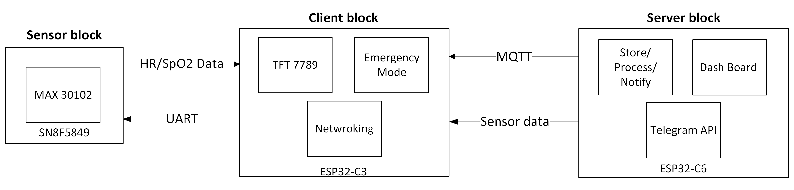

# Engineering Handbook

## Overall Information

This handbook serves as a comprehensive guide for the engineering principles, methodologies, and technical details involved in this project. It is structured to facilitate understanding for both new and experienced engineers, providing insights into the development, implementation, and operation of the system.

The handbook is designed to be read sequentially, but each chapter can also be referenced independently as needed.

## How To Read This Handbook

This handbook is written in Markdown format, which is a lightweight markup language that makes it easy to structure and style text. For an optimal reading experience, it is recommended to use a dedicated Markdown reader such as Obsidian or Visual Studio Code with a Markdown plugin. These tools will provide features like easy navigation, links, and proper rendering of the content.

If you want to view images or any local content referenced in the handbook, make sure to clone the repository where this handbook is stored. This will allow you to access any embedded images or files linked within the document. If you're new to Markdown, most text editors and viewers can also display it correctly, but using a specialized tool will enhance your experience.

# Table Of Contents

### [Phase 1: Preparation](#phase-1-preparation)

- [Week 1: Team-Forming, Workflow and Topic](#team-forming-workflow-and-topic)
- [Week 2: Ideas and Vision](#week-2-ideas-and-vision)
- [Week 3: Rust Basics 1](#week-3-rust-basics-1)
- [Week 4: Rust Basics 2](#week-4-rust-basics-2)
- [Week 5: Rust Embedded 1: esp-hal, no-std](#week-5-rust-embedded-1-esp-hal-no-std)
- [Week 6: Rust Embedded 2: Embassy Framework + Lab Work 1: Soldering Basics](#week-6-rust-embedded-2-embassy-framework--lab-work-1-soldering-basics)
- [Week 7: Serial Communication Protocols: I2C, SPI, UART](#week-7-serial-communication-protocols-i2c-spi-uart)

### [Phase 2: Design and Create](#phase-2-design-and-create)

- [Week 8: System Design 1: What to Include?](#week-8-system-design-1-what-to-include)
- [Week 9: Sensors: MAX30102, MPU6050](#week-9-sensors-max30102-mpu6050)
- [Week 10: Components: ESP32-C3, ESP32-C6, SSD1306](#week-10-components-esp32-c3-esp32-c6-ssd1306)

### [Phase 3: Report and Testing](#phase-3-report-and-testing)

- [Week 11: Assemble Together 1. Lab Work 2](#week-11-assemble-together-1-lab-work-2)
- [Week 12: Assemble Together 2. Report 1. Testing 1](#week-12-assemble-together-2-report-1-testing-1)
- [Week 13: Assemble Together 3. Report 2. Testing 2](#week-13-assemble-together-3-report-2-testing-2)
- [Week 14: Report 3 and Conclusion](#week-14-report-3-and-conclusion)

# Phase 1: Preparation 
## Week 1: Team-Forming, Workflow and Topic (NOT WORKING YET)

### Date: Mar 03, 2025

#### a. Group 9:
- Consists of 3 members
#### b. Workflow and Rules
- Summary:
	- All group work resides in the common public GitHub repository
	- Messages via Messenger
	- Meetings through Teams
	- Offline meetings in Lab when needed.
- More details in the file [WORKFLOW](Resources/WORKFLOW.md)
#### c. Topic

#### d. Conclusion

## Week 2: Ideas and Vision (NOT DONE)

#### Date: Mar 10, 2025

#### a. Ideas and Vision

Overall block diagram of the system:

A snippet of the sequential diagram the system can behave:

#### b. Conclusion

This architecture ensures a robust, secure, and user-friendly connection between SpO₂ monitoring clients and the central server. The combination of **proximity-based pairing, cryptographic authentication, and encrypted communication** mitigates security risks while maintaining ease of use for end-users. The design choices made prioritize practical security within the constraints of embedded systems, ensuring a reliable and efficient solution.

Investigation of the topic is in [Investigation](Investigation.md)
Initial Setup of the system: [Initial_Setup_Idea](Resources/Initial_setup_idea.md)
For criterion, specifications: [Specifications](Resources/specifications.md)
In communication specifications: [Connection_Specifications](Resources/connection_specifications.md)
## Week 3: Rust Basics 1 (DONE)
#### Date: Mar 17, 2025

#### Task: Learn the basics of Rust. Part 1: The Basics

#### a. Rust the Programming Language

Rust is a general-purpose programming language emphasizing performance, type safety, and concurrency. It enforces memory safety, meaning that all references point to valid memory.

In Basics 1, we will learn about basics of Rust: Cargo, Variables, Data Types, Functions, Control Flow, Enums, Structs

The task for the week is to:

- Understand the basics of Rust
- How to Install Rust environment on machine, how to work with Cargo, rustup, setup in VSCode, Extensions
- Write a small code that is "guessing game", guessing a number from 1 to 10 in command line
- Compare C, Rust and Python by adding 1 million times.

Please document everything you done, even the installation of Rust, environment

### **b. Conclusion**

This first week of learning Rust laid the essential groundwork for understanding its syntax, tooling, and core programming model. Starting from environment setup to writing basic programs, we gained hands-on familiarity with Rust's development workflow.

We began by **installing the Rust toolchain** using `rustup`, configuring the environment, and integrating it with **VSCode**. The extensions `rust-analyzer`, `crates`, and `CodeLLDB` provided a smooth and powerful development experience, with features such as type hints, code navigation, and debugging.

Through building a **command-line guessing game**, we applied key Rust concepts including:

- **Variable binding and mutability**
- **Primitive data types and type inference**
- **Function definitions and control flow (if, loop, match)**
- **Use of external crates** (`rand`) and basic input/output with `std::io`
    
This simple project reinforced the structure of a typical Rust program and introduced how **Cargo** manages project scaffolding, dependencies, and builds.

We also conducted a **performance comparison** by implementing a loop that adds numbers up to 1 million in **C**, **Rust**, and **Python**. The results highlighted:

- **C and Rust** achieving similar performance due to their compiled, low-level nature.
- **Python** being significantly slower, reinforcing Rust’s potential in performance-critical applications with safer memory handling than C.

Overall, Rust’s unique value was clearly demonstrated:

- It provides **C-like performance** while enforcing **memory safety** through ownership and borrowing.
- Its tooling and compiler are exceptionally helpful for catching bugs early.
- The language is **well-suited for both systems programming and high-level application logic**.
    
In summary, this week built a strong foundation in Rust, showing how it combines modern programming ergonomics with low-level control and safety. These core concepts will be expanded upon in future tasks involving embedded systems, hardware abstraction, and asynchronous programming.

More details in the file [Rust_01](Resources/Rust_01.md)
## Week 4: Rust Basics 2 (DONE)

#### Date:  Mar 24, 2025

#### a. Borrow Checker, Ownership

Ownership is a discipline for ensuring the **safety** of Rust programs. Ownership In Rust, **each value has a single owner**, and when that owner goes out of scope, the value is **automatically dropped** (freed).

In researching in Rust Ownership system, you should understand:
- How memory is managed in Rust (or any computer system): the Heap, the Stack, how variables is store and references
- Some other forms of memory manipulation: malloc(), pointers in C
- Key rules of Ownership, what Ownership is. Aliasing, Mutation, borrow checker enforce permissions
- Slice Type

Your task is to note down what you have learned, and include relevant diagrams showing reference conditions and connections when necessary in examples.
#### b. Concurrency and async/await

**Concurrency** is a discipline for ensuring the **correctness and performance** of programs that execute **multiple tasks in overlapping time**. In Rust, concurrency is designed to be **memory-safe and race-free** at compile time, thanks to the **ownership system and the borrow checker**.

In researching concurrency in Rust, you should understand:

- What **threads** are (OS-level or user-level), and how they share CPU cores.
- The difference between:
* Concurrency (task switching)
	* Parallelism (actual simultaneous execution on multiple cores)
	* Asynchronous programming (non-blocking I/O, task suspension)
- What **data races** are, and why languages like C++ and Java need locks/mutexes to avoid them.
- Why async/await is important for microprocessors than true core parallelism. How to do async/await in Tokio.

Your task is to note down what you have learned.
#### c. Conclusion

We have learned the core idea of Rust: **Ownership**. Ownership is the foundation of Rust’s memory safety guarantees, enabling it to manage memory without a garbage collector. By enforcing that each value has a single owner and using the borrow checker to manage references, Rust prevents common bugs like use-after-free, double-free, and data races at **compile time**.

Through exploring the ownership system, we gained insights into how memory is structured in the stack and heap, how borrowing and references work, and how aliasing and mutation are tightly controlled to ensure safe and predictable behavior. Concepts like slices, which are borrowed views into collections, further demonstrate Rust’s balance between safety and flexibility.

In the context of **concurrency**, Rust leverages this same ownership model to ensure **race-free, memory-safe multithreading**. Unlike other languages that rely on runtime checks and locks, Rust ensures thread safety through its type system and traits like `Send` and `Sync`. This guarantees that data cannot be shared unsafely across threads.

Additionally, Rust’s **async/await model** provides an efficient and safe way to perform non-blocking I/O, ideal for applications where performance matters and system resources are constrained. With runtimes like **Tokio**, developers can write highly concurrent applications with minimal overhead, all while benefiting from Rust’s safety guarantees.

In conclusion, Rust’s unique combination of **ownership, borrowing, and type-driven concurrency** makes it a powerful language for writing **safe, efficient, and scalable** systems. Understanding these principles is key to mastering Rust and unlocking its full potential.

More details in the file [Rust_02](Resources/Rust_02.md)
## Week 5: Rust Embedded 1: esp-hal, no-std (DONE)
#### Date: Mar 31, 2025 

#### a. Overall Development Solutions for ESP

ESP microcontrollers by Espressif support multiple development environments for different needs. **ESP-IDF** is the official C/C++ SDK for low-level, full-featured development. **Arduino-ESP32** simplifies programming with the Arduino API in C++. **MicroPython** and **CircuitPython** offer easy scripting with Python, ideal for rapid prototyping. Each environment balances control, performance, and ease of use depending on the project.

Overall Embedded Rust development space have project embedded-hal and embedded-hal-async standard

For Rust, esp-rs provide two main paths for developing in Rust:
- Native: hardware abstraction layers for ESP directly written in Rust: there are esp-hal for no-std and std (esp-idf-hal)
- Wrappers that abstracts away C of ESP-IDF in Rust. For example, esp-idf-sys.

Your task is to:

- Evaluate why Rust is superior to other languages in embedded environment
- Give definitions for wrappers, bindings, hardware abstraction layers embedded programming.
- Consider what should be used in the scope of the project, given the constraints in project time, complexity and effort.
#### b. Set up esp-hal

esp-hal is a no-std bare metal hardware abstraction layer for ESP processors in Rust.

Your task is to:
- Overview on crate esp-hal: What functions does it serve, what settings, system can it uses
- Showing how to setup environment for esp-hal development, you should show how to include to Cargo, how to set up new projects with esp-generate and flash with espflash, cargo espflash workflow.
#### c. Conclusion

 Given the project’s complexity and the limitations in time and development effort, **Rust’s no-std approach with `esp-hal` has been selected as the framework** for implementation. This choice is grounded in a careful evaluation of available tools, safety guarantees, and maintainability.

Rust offers several key advantages in embedded development:

- **Memory safety without a garbage collector**: Critical for microcontrollers with limited resources.
- **Zero-cost abstractions**: You get high-level syntax without runtime overhead.
- **Strong type system and ownership model**: Prevents common bugs at compile time, including null dereferencing, data races, and buffer overflows.
- **Excellent tooling**: Rust’s build system (`cargo`), formatter (`rustfmt`), and linter (`clippy`) integrate well with embedded workflows.
    
We explored two approaches in the Rust embedded ecosystem:

- The **native HAL** (`esp-hal`), which is built entirely in Rust and targets bare-metal, no-std environments.
- The **ESP-IDF wrapper** (`esp-idf-sys`, `esp-idf-hal`), which binds to the C-based ESP-IDF SDK and offers more out-of-the-box functionality, but at the cost of increased setup complexity and reliance on external toolchains.

While the wrapper approach provides broader support for ESP32 peripherals and network stacks, it also introduces more dependencies, larger binary sizes, and less control over low-level details — which can be a hindrance in time-constrained or resource-sensitive projects.

By contrast, `esp-hal` supports direct access to hardware with:

- Full control over startup code, peripherals, and memory layout.
- Simplified build pipeline with `espflash` and `esp-generate`.
- A purely Rust-based workflow, reducing reliance on external C toolchains.

Given the project’s need for **tight control, minimal runtime overhead**, and a **focused development process**, the no-std `esp-hal` approach strikes the best balance between performance, safety, and simplicity. It allows us to develop safe and predictable embedded software in Rust, without sacrificing control or bloating the toolchain.

Thus, **`esp-hal` is the recommended foundation for this project**, with the confidence that Rust’s safety and performance guarantees will carry through even in low-level, resource-constrained environments.

More details is in the file [Rust_Embed_01](Resources/Rust_Embed_01.md)
## Week 6: Rust Embedded 2: Embassy Framework + Lab Work 1: Soldering Basics (DONE)

### Date: Apr 7, 2025

Embassy is a project to make async/await a first-class option for embedded development.
Soldering is a needed skill for every electronics engineer.

Your task is to: 
- Understand Embassy: How it achieves async without RTOS. What are executors. How to config your peripherals to work async with Embassy.
- Learn soldering: How to solder, choosing the right tool, temperature and solder basic GPIO pins on the lab.

#### c. Conclusion

More details of Embassy is in the file [Rust_Embed_02](Resources/Rust_Embed_02.md)
Tips for soldering is in the file [Soldering](Resources/Soldering.md)

## Week 7: Serial Communication Protocols: I2C, SPI, UART. (DONE)

### Date: Apr 14, 2025

This week focuses on the fundamental ways embedded devices talk to each other. These protocols form the backbone of sensor interfacing, memory communication, and peripheral control in microcontroller systems.

Your task is to:

- Learn the theory behind each protocol: how I2C handles addressing, how SPI ensures speed through simplicity, and why UART remains ubiquitous.
- Analyze their timing, signaling, and wiring differences.
- Practice: use a microcontroller to interface with at least one I2C sensor and one SPI device. Observe signal traces with a logic analyzer or oscilloscope.

#### Conclusion

More details is in the file [CommProtocol.md](CommProtocol.md)

# Phase 2: Design and Create

## Week 8: System Design 1: What to Include? (NOT WORKING YET)

### Date: Apr 21, 2025

This week shifts from isolated components to thinking like a system designer. You’ll begin architecting a complete embedded device—from sensing to decision-making to user interaction.

Your task is to:

* Define the **hardware stack**: Choose your MCU , power supply, input/output components, sensors (e.g., temperature, IMU, light), and user interface elements like buttons or a small display (e.g., OLED or TFT screen).
* Identify the **software stack**: What operating model are you using—bare metal, RTIC, or async with Embassy? What crates/libraries are needed for drivers, HALs, or communication layers?
* Map the system in terms of **data flow**: Where does the data originate, how is it processed, and where does it go (e.g., display, logs, actuators)?
* Create **flowcharts** for user interactions or sensor events.
* Draw **software diagrams** to clarify module responsibilities, message passing, and layers of abstraction.
* Design **finite state machines (FSMs)** to handle device modes (e.g., idle, collecting, error, transmitting).

By the end of the week, you should have a clear top-down plan of your system—hardware and software—that will guide implementation in future labs. 
#### Conclusion

We conclude that the scope of project, Sensor block integrated into client block, Server block is not being developed

More details is in the file [System_Design_01](Resources/System_Design_01)

## Week 9: Sensors: MAX30102, MPU6050, Lab Work 2 (DONE)

### Date: Apr 28, 2025

This week focuses on working with real-world sensors—capturing meaningful data from the physical environment and integrating it into your system.

Your task is to:

- Understand how the **MAX30102** works: its use in pulse oximetry and heart rate monitoring, I2C interface, and how to configure it for reliable readings. Learn how to read raw IR/Red data and filter it for usable heart rate or SpO2 estimation.
- Explore the **MPU6050**: a 6-axis IMU combining accelerometer and gyroscope. Learn about register configuration, scaling factors, and how to interpret motion data.
- Integrate both sensors into your system via I2C.
- Test and visualize sensor data on a screen or via serial logging.
- Research and note about the library [max3010x](https://docs.rs/max3010x/latest/max3010x/) library and [mpu6050](https://docs.rs/mpu6050/latest/mpu6050/) library, what functions do they support, how to do sensor reading.
- Consider the possibilities of algorithms and tools to calculate, save and process sensor data. Kalman filters are recommended. 

Extend your system diagrams to include sensor data flow and processing stages. Document your signal processing steps and update your FSMs to include sensor-driven state transitions.
#### Conclusion

This week focused on bridging the gap between digital computation and the physical world by integrating real-time **sensor data** into our embedded system. By working with the **MAX30102** and **MPU6050**, we gained practical experience in sensor communication via **I2C**, signal interpretation, and real-world data processing.

The **MAX30102** sensor provided valuable physiological data—specifically, IR and red light absorption values used for **heart rate and SpO₂ estimation**. Using the `max3010x` Rust crate, we were able to initiate the sensor, configure its sampling parameters, and read raw data frames. This allowed us to begin prototyping basic **signal filtering and pulse detection algorithms**, which are crucial for deriving meaningful biometric insights.

The **MPU6050** provided motion data by combining a 3-axis accelerometer and 3-axis gyroscope. With the `mpu6050` crate, we successfully read and interpreted acceleration and angular velocity data. We began experimenting with **scaling factors**, orientation estimation, and **noise filtering**, preparing the system for responsive behaviors based on motion.

Both sensors were integrated via I2C, with successful communication verified through **serial output logging**. This real-time data stream not only validated sensor integration but also served as the foundation for **signal visualization and debugging**.

From a systems perspective:

- We explored potential **signal processing techniques**—including **Kalman filtering**—to smooth noisy sensor data and enable robust, real-time decisions.
    
In summary, this week solidified the sensor layer of the system.

Also, a lab work investigating I2C signal with Ocilloscopes is being done.

C testing for mpu6050 is provided folder test_C
Rust testing code for max30102 and mpu6050 is in folder max30102

More details is in the file [Sensors](Resources/Sensors), [Kalman](Resources/Kalman.md)

## Week 10: Components: ESP32-C3, ESP32-C6, SSD1306  (DONE)

### Date: May 05, 2025

#### a. Microcontrollers: ESP32-C3, ESP32-C6

This week focuses on key components you’ll likely use in your final embedded system design: microcontrollers and displays. You'll get hands-on with the **ESP32-C3** and **ESP32-C6**, two modern, RISC-V-based Wi-Fi/Bluetooth MCUs from Espressif, and the **SSD1306**, a widely used I2C OLED display controller.

Your task is to:

- Explore the **ESP32-C3** and **C6**: understand their core differences (e.g., RISC-V vs Xtensa, BLE/Wi-Fi capabilities, peripherals), and how to flash Rust firmware using tools like `espflash`.
- Set up a minimal Rust application using the `esp-hal` and Embassy (or bare-metal if preferred). Blink an LED, log over serial, and initialize I2C.
- Update your system diagrams and FSMs to include display logic (e.g., idle screen, error messages, real-time sensor output).
- Compare power consumption, peripheral support, and async compatibility between the ESP32-C3 and C6—decide which fits your final project best. Evaluate which pins support I2C, SPI, UART.
#### b. OLED Screen: SSD1306

- Understand the workings of SSD1306 and its Rust driver: How does images get encoded, transferred? What is Buffered Graphics?
- Buffered Graphics of SSD1306 are compatible with another popular graphics library: embedded_graphics. Please explain the functionalities of the library and how to design from it.
- Integrate the **SSD1306** OLED display: initialize over I2C, draw text and graphics, and build a reusable screen abstraction.
#### c. Conclusion

Through exploration of the **ESP32-C3**, **ESP32-C6**, and **SSD1306 OLED display**, we gained experience in embedded hardware, display rendering, and system-level design.

#### ESP32-C3 vs ESP32-C6

We examined and worked hands-on with two modern **RISC-V-based** Espressif microcontrollers:

- **ESP32-C3**: Single-core RISC-V with Wi-Fi and BLE 5.0, good community support, and mature `esp-hal` crates.
- **ESP32-C6**: Dual-mode Wi-Fi 6 + BLE 5.2, support for **802.15.4 (Thread/Zigbee)**, and more advanced peripherals—but with less Rust ecosystem maturity as of now.
    
We compared them in terms of:

- **Core architecture and performance**
- **Peripheral support (I2C/SPI/UART availability)**
- **Power consumption**
- **Async support with Embassy (C3 is currently more compatible)**
    
Rust firmware was successfully flashed using `espflash`, and we created a **minimal embedded application**:

- Blinking an on-board LED
- Logging debug output over serial (via `defmt`)
- Initializing I2C for display/sensor communication

From this exploration, **ESP32-C3** was selected as the better fit for the current project scope due to better tooling, community support, and sufficient features for sensor + display integration.

#### SSD1306 OLED Display and Display Abstractions

The **SSD1306** display, interfaced via I2C, was initialized using the `ssd1306` Rust crate. We learned how the display uses a **framebuffer model (Buffered Graphics)**, allowing drawing to a RAM buffer before flushing it to the screen. This avoids flickering and enables rich visuals.

We leveraged **`embedded-graphics`**, a core Rust crate for rendering shapes, text, and images across many types of displays. It provided:

- Primitives like lines, rectangles, circles
- Text rendering with custom fonts
- Layout abstractions for reusable UI elements

We built a **reusable display module** that:

- Shows system states (e.g., idle, error, active)
- Displays live sensor data (heart rate, motion)
- Uses screen clearing, buffer flushing, and conditional drawing to control what the user sees

The **FSMs** were extended to include **display feedback per state**, enabling the device to visually respond to both internal and environmental changes.

More details is in the file [Controller](Resources/Controller.md)
# Phase 3: Report and Testing

## Week 11: Assemble Together 1. Lab Work 2 (NO REPORT YET)

### Date: May 12, 2025

### **a. In Software**

This week, we attempted to unify previously developed software modules—sensor drivers (MAX30102, MPU6050), display control (SSD1306), and microcontroller firmware—into a single, cohesive Rust project. The goal was to initialize all components concurrently, enabling synchronized data acquisition, display, and logging.

We utilized:

- The `esp-hal` crate for hardware abstractions
- `embassy` for async task management and concurrent peripherals
- `max3010x`, `mpu6050`, and `ssd1306` crates for sensor/display drivers
- I2C communication over async/await with `embassy-time` for cooperative multitasking
    
However, **integration issues emerged** when combining I2C devices with the async `embassy` framework. Specifically:

- The I2C drivers for `mpu6050` and `max3010x` expect blocking I2C traits from `embedded-hal`
- The async I2C abstraction from Embassy (`embassy_embedded_hal`) is not directly compatible with the existing sensor drivers
- Attempting to convert or wrap interfaces led to lifetime or trait errors, due to mismatched expectations between blocking and async APIs

We were unable to get all components to communicate simultaneously under Embassy-based concurrency.

### **b. In Hardware**

Hardware setup involved:

- Connecting the MAX30102, MPU6050, and SSD1306 to the ESP32-C3 via I2C
- Using a shared bus with appropriate pull-up resistors
- Verifying individual sensor power and signal integrity with a logic analyzer and multimeter
- Ensuring SDA and SCL lines were stable, voltage levels were correct (3.3V), and no shorts existed

Each device functioned **individually** when tested in isolation. However, when combined on the same I2C bus within the integrated firmware, we encountered failures—likely due to timing mismatches or conflicting I2C transaction expectations between blocking and async approaches.

### **c. How to Make Things Work Together**

To unify the system, several possible paths forward were identified:

1. **Avoid async/Embassy** for now and fall back to a **pure `esp-hal` + blocking driver** architecture. This would ensure compatibility with current sensor/display crates and allow stable integration.
2. Wait for or contribute to the development of **async-compatible sensor drivers** that fully support the `embedded-hal-async` traits.
3. Explore using **separate microcontrollers** for sensors and display, communicating via UART or SPI to a central processor, to bypass I2C bus conflicts (not ideal given time constraints).
4. Use a **manual I2C multiplexer** or addressable switching to reduce concurrent bus contention—though this adds complexity.
    

Given the time limitations, solution (1) is the most practical short-term fix.

### **d. Conclusion**

The objective this week was to **assemble all hardware and software components** into a single functioning system. While each module worked individually, we faced major compatibility issues between **async I2C (Embassy)** and **blocking-based sensor/display drivers**. These mismatches prevented us from running all devices concurrently.

This highlighted a current limitation in the embedded Rust ecosystem: **limited async driver support** for common peripherals. As a result, our conclusion is that the **Embassy framework is not yet mature enough** for full system integration using the available crates.

Next steps will involve:

- Refactoring the system to use blocking `esp-hal` drivers
- Gradually reintroducing features once a working baseline is confirmed
- Continuing to monitor the development of async-compatible libraries for future upgrades

## Week 12: Assemble Together 2. Report 1. Testing 1

### Date: May 19, 2025

#### a. Report Standards, Preparation
- Report on SSD1306 is lacking in embedded-graphics description.
- Please include images on testing and adding code
- Report on MAX30102 lacking byte address and byte code for each command.

#### b. Preparation

#### c. Conclusion

## Week 13: Assemble Together 3. Report 2. Testing 2
### Date: May 26, 2025

#### a. Packaging

#### b. Toolchain

#### c. Slides

#### d. Conclusion
## Week 14: Report 3 and Conclusion

### Date: Jun 02, 2025

#### a. Ratings, evaluation, compliance.
#### b. Key ideas found

#### c. Scrapped Ideas

#### d. Beyond Microprocessors

#### e. Conclusion

