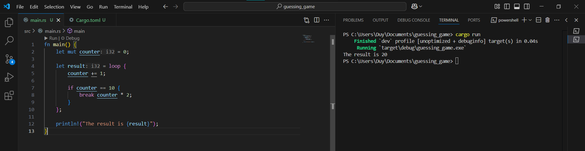
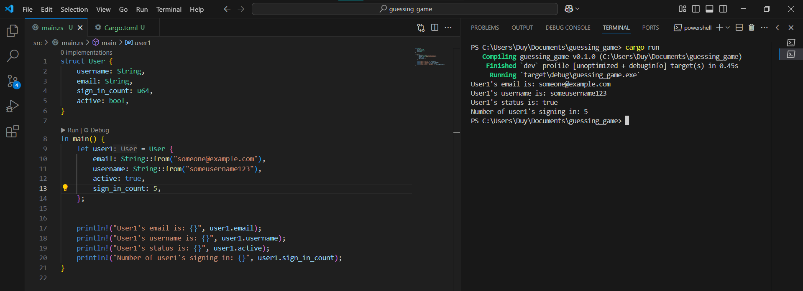

# Learning rust programming language
## Date 17/3/2025: Install rust and learn Hello World/ Hello Cargo
First approach to rust [book](https://doc.rust-lang.org/book/title-page.html). Chapter 1 is about installing rust programming language and first approach to rust with `cargo` and `rustc` 


**Sucessfully installed!**  rust on windows via the [rust website](https://www.rust-lang.org/) and the extension: **Rust analyzer** in VS Code.


### Learning Rust Basics
#### Hello World!
First rust program: **Hello World!**. Create a file named `main.rs` in VS Code and execute the code:
```rust
fn main() {
    println!("Hello, world!");
}
```
Using `rustc` to compile the code and execute the `main.rs` file to run the program.


- This program is only about how to run with rustc (rust compiler) to print the string "Hello, world!" of the function named *main* to the screen but it's recommended to use `cargo` through out the whole project because it's a more powerful tool.
#### Hello Cargo!
**Cargo** is Rust's build system and package manager. This tool help us to handle taks like building code, download libraries that our code depends on and build those libraries (or in rust they are called *depedencies*).
We follow the tutorial of the book, execute the `cargo` command:
```
cargo new hello_cargo
cd hello_cargo
```
This command creates a directory named *hello_cargo* and `cargo` creates some files in it:


We focus on the 2 files: the `main.rs` file in **src** directory and the `Cargo.toml` file:
- `main.rs`: main coding file.
- `Cargo.toml`: dependecies file, where all the libraries that support our code to work exist in here.
To run a `cargo` project, we have to build it and run it. Normally we need to build and execute the exe file seperately but the run command in rust would execute the code right after finishing building it so we just need to run this command:
```
cargo run
```
And here is our result: 

Rust automatically targets the exe file in targert directory when we run the programm and execute it. 

After finished chapter 1 of rust book, we make a comparison between `rustc` and `cargo`, the two core tools in the Rust programming ecosystem to decide which tool to use:

| Feature                   | `rustc` (Rust Compiler)                         | `cargo` (Rust Package Manager & Build System)       |
| ------------------------- | ----------------------------------------------- | --------------------------------------------------- |
| **Purpose**               | Compiles a single Rust source file              | Manages full Rust projects (build, run, test, etc.) |
| **Typical Use Case**      | Quick one-file compilation or low-level control | Complete project management (most common usage)     |
| **Compilation Command**   | `rustc main.rs`                                 | `cargo build`, `cargo run`, `cargo test`, etc.      |
| **Dependency Management** | ❌ Not supported                                 | ✅ Handles dependencies via `Cargo.toml`             |
| **Project Structure**     | No required structure                           | Expects standard project structure (`src/`, etc.)   |
| **Build Scripts**         | ❌ No automation                                 | ✅ Automatically handles builds, output folders      |
| **Testing Support**       | ❌ No direct support                             | ✅ `cargo test` runs unit/integration tests          |
| **Benchmarking & Docs**   | ❌ No support                                    | ✅ `cargo bench`, `cargo doc`                        |
| **Ease of Use**           | ❌ Manual, low-level                             | ✅ High-level, user-friendly                         |
| **Speed of Development**  | Slower for larger projects                      | Faster thanks to automation                         |
| **Use by Developers**     | Rarely used directly for large apps             | Preferred for most Rust development tasks           |

---

#### Summary:

* **Use `cargo`** for almost all real-world Rust development. It handles everything: compiling, dependency resolution, testing, documentation, and more.
* **Use `rustc`** only for educational purposes, experimenting with one-file programs, or fine-tuning compilation.

## Day 18/3/2025: Programming Guessing Game in Rust
### Learning Rust Basics
#### Setting up enviroment
We now use `cargo` to create our projects:
```
cargo new guessing_game
cd guessing_game
```
Just like yesterday, we obtain a directory with a bunch of files in there:


#### Processing a Guess
Follow the tutorial of chapter 2 of [rust book](https://doc.rust-lang.org/book/ch02-00-guessing-game-tutorial.html), the `main.rs` becomes like this:
```rust
use std::io; 

fn main() {
    println!("Guess the number!");

    println!("Please input your guess.");

    let mut guess = String::new();

    io::stdin()
        .read_line(&mut guess)
        .expect("Failed to read line");

    println!("You guessed: {}", guess);
}
```
First, we try to run it for the first time to look at it with: 
```
cargo run
```

We can see that just like yesterday, it first compiles the project and runs the program right after. The program ask the user for their input and print it to the screen. Now, follow the tutorial of the book, we can understand some of the concepts of rust programming language.

First, it calls out the `io` library inside the `std` library to use some functions of its:
```rust
use std::io;
```
Then in the `main` function:
```rust
    println!("Guess the number!");

    println!("Please input your guess.");
```
These two `println!` function print to the screen the messages suggest the user to type in there guess. So we need a variable to store the user's input string and we named it *guess*
```rust
    let mut guess = String::new();
``` 
`mut` here means that it can change(mutable) through out the program. The basic type of Rust programming language is unmutable so we have to take care of mutable variables.
```rust
    io::stdin()
        .read_line(&mut guess)
        .expect("Failed to read line");
```

This function recieve the user input by using the io library and the function `read_line` of its to get the user input. `expect` just try to handle the error. If errors exist, it will print to the screen *"Failed to read line"*. Here, we notice the `&` notation as a reference (which is the address to take the value of the variables), and `guess` can be mutable so we also add `mut` before it.

To test the error handling of rust, we also try to run the program without the `expect` function and see what happens here: 


So it warns us should handle the result so that is pretty fine, or we can just follow the suggestion to ignore the result value. And then, it continues to compile and run the program.
```rust
    println!("You guessed: {}", guess);
```
Finally, the program print out the value of the user's input value.
#### Generating Guess Number
Continue the tutorial, now we learn how to generate secret number. It's recommended that to generate random secret number every time we run the program. We first introduced how to use crate in rust with `rand` crate. To use it, we have to modify the `Cargo.toml` with :
```toml
[dependencies]
rand = "0.8.5"
```


Now we try to build it with:
```
cargo build
```


So obviously that it has to build the crate that we added and compile it. Then to use it, we have to add it with `use rand::Rng`. Also we want to compare the user input with secret number so we add the `cmp::Odering` of `std` library to compare the with it. 
```rust
use rand::Rng;
use std::cmp::Ordering;
use std::io;

fn main() {
    println!("Guess the number!");

    let secret_number = rand::thread_rng().gen_range(1..=100);

    loop {
        println!("Please input your guess.");

        let mut guess = String::new();

        io::stdin()
            .read_line(&mut guess)
            .expect("Failed to read line");

        let guess: u32 = match guess.trim().parse() {
            Ok(num) => num,
            Err(_) => continue,
        };

        println!("You guessed: {guess}");

        match guess.cmp(&secret_number) {
            Ordering::Less => println!("Too small!"),
            Ordering::Greater => println!("Too big!"),
            Ordering::Equal => {
                println!("You win!");
                break;
            }
        }
    }
}
```
Run this program and we obtain the result like this: 


This is pretty basic so we speeded up the process to learn new concepts of Rust. 

## Day 19 - 20/3/2025: Variables, Data Types, Functions and Comment
### Variables
This is where we follow the chapter 3 of rust book.

In Rust, variables are **immutable by default**. This means once we assign a value to a variable, we can't change it. This default behavior encourages us to write safe and predictable code.

#### Immutable Variables

When we try to change an immutable variable, the Rust compiler gives us an error. For example:

```rust
fn main() {
    let x = 5;
    println!("The value of x is: {x}");
    x = 6; // Error!
}
```

The compiler helps us catch bugs early by preventing unwanted changes to values we promised wouldn't change.

#### Making Variables Mutable

Sometimes we *do* want to change a value. We can do that by adding `mut`:

```rust
fn main() {
    let mut x = 5;
    println!("The value of x is: {x}");
    x = 6;
    println!("The value of x is: {x}");
}
```

Using `mut` shows our intention clearly and makes it easier for others (and ourselves later!) to understand that this variable will change.

#### Constants

Constants in Rust are similar to immutable variables, but:

* We **must** use the `const` keyword.
* They are always immutable and must have a **type annotation**.
* Constants are evaluated at **compile time**, not runtime.

Example:

```rust
const THREE_HOURS_IN_SECONDS: u32 = 60 * 60 * 3;
```

Constants are great for values that stay the same throughout the program, like a maximum score or conversion factor.

#### Shadowing

We can declare a new variable with the same name to **transform or update** it. This is called **shadowing**.

```rust
fn main() {
    let x = 5;
    let x = x + 1;

    {
        let x = x * 2;
        println!("Inner x: {x}"); // 12
    }

    println!("Outer x: {x}"); // 6
}
```

Shadowing is different from `mut`:

* With `let`, we create a **new variable**.
* We can **change the type** too:

```rust
let spaces = "   ";
let spaces = spaces.len(); // Now it's a number!
```

If we try this with `mut`, Rust will throw a type mismatch error, because mutability doesn't allow type changes.

#### Summary of What We Learn

* Rust encourages **immutability** to make programs safer.
* We can use `mut` if we need to change values.
* Constants are **always immutable** and require **type annotations**.
* **Shadowing** lets us reuse variable names and even change types safely.

### Data Types
#### Scalar 
| **Type**                          | **Size / Structure**         | **Examples / Notes**                                                          |
| --------------------------------- | ---------------------------- | ----------------------------------------------------------------------------- |
| `i8`, `i16`, `i32`, `i64`, `i128` | Signed integers (8–128 bits) | e.g., `let x: i32 = -42;` <br> Use for whole numbers with potential negatives |
| `u8`, `u16`, `u32`, `u64`, `u128` | Unsigned integers            | e.g., `let y: u8 = 255;` <br> Cannot be negative                              |
| `isize`, `usize`                  | Pointer-sized integers       | Size depends on architecture (32-bit or 64-bit) <br> Used for indexing        |
| `f32`, `f64`                      | 32-bit or 64-bit floats      | Decimal numbers, IEEE-754 standard <br> `f64` is the default float            |
| `bool`                            | 1 byte (usually)             | Only `true` or `false`                                                        |
| `char`                            | 4 bytes (Unicode scalar)     | Single character like `'a'`, `'ß'`, `'🎯'`                                    |

---

#### Integer Literal Formats

| **Format**  | **Example**   | **Description**             |
| ----------- | ------------- | --------------------------- |
| Decimal     | `98_222`      | Underscores for readability |
| Hex         | `0xff`        | Hexadecimal (base 16)       |
| Binary      | `0b1010_1010` | Binary (base 2)             |
| Byte (`u8`) | `b'A'`        | Byte literal (ASCII only)   |

---

#### Integer Overflow Behavior

| **Context**  | **Behavior**                                                       |
| ------------ | ------------------------------------------------------------------ |
| Debug Mode   | Program **panics** on overflow                                     |
| Release Mode | Uses **wrapping (two’s complement)** arithmetic                    |
| Safe Methods | `wrapping_add`, `checked_add`, `saturating_add`, `overflowing_add` |

---

#### Compound Types

| **Type**            | **Structure**                                     | **Examples / Notes**                                           |
| ------------------- | ------------------------------------------------- | -------------------------------------------------------------- |
| `tuple`             | Group of fixed-size values of **different types** | `let tup = (500, 6.4, 'x');` <br> Access with `.0`, `.1`, etc. |
| `array`             | Fixed-size, **same type** values                  | `let a = [1, 2, 3, 4];` <br> Use index to access elements      |
| `array` (shorthand) | Repeated values                                   | `let b = [0; 5];` → `[0, 0, 0, 0, 0]`                          |

#### Functions
**Functions in Rust** start with the `fn` keyword. The special `main` function is the program's entry point.
**Snake case** (`another_function`) is used for naming.
You **define a function** with `fn name() {}` and **call** it with `name()`.
This is how we can define a functions and use it:

```rust
fn main() {
    another_function();
}

fn another_function() {
    println!("Another function.");
}
```

#### Parameters
Functions in Rust can take **parameters**:

```rust
fn another_function(x: i32) {
    println!("x is: {x}");
}
```

We must **specify the type** of each parameter.

#### Statements vs Expressions

* **Statements**: Do something, no value returned.
  `let x = 5;` → statement
* **Expressions**: Produce a value.
  `x + 1` → expression
* Blocks like `{ let x = 3; x + 1 }` are expressions returning `4`.

---

#### Return Values

* Functions can return values using `-> Type`:

```rust
fn five() -> i32 {
    5  // no semicolon = expression = return value
}
```

* We can return early with `return`, but usually the **last expression** is returned automatically.

```rust
fn plus_one(x: i32) -> i32 {
    x + 1
}
```
### Comments
*Comments* is really simple, and just like other programming language we use:
```rust
//This is a comment
```
And if we want to use *comments* for a block of code rather than a single line, we use:
```rust
/* 
These are comments
*/
```
## Day 21 - 22/3/2025: Control Flow, Enum and Structs
### Control Flow
#### If Expressions
If expressions are very common so we understand this concept in Rust very quickly. So we gonna just point out how to use `if` in rust:
* Start with `if` + Boolean condition
* Optional `else if` and `else` provides alternative block
* Condtion must be `bool`
* We can use `let` in `if` expressions
Here is an simple example about using it: 
```rust
fn main() {
    let number = 6;

    if number % 4 == 0 {
        println!("divisible by 4");
    } else if number % 3 == 0 {
        println!("divisible by 3");
    } else if number % 2 == 0 {
        println!("divisible by 2");
    } else {
        println!("not divisible by 4, 3, or 2");
    }
    // Another way to use if expressions
    let condition = true;
    let number = if condition { 5 } else { 6 };
    println!("The value of number is: {number}");
}
```

#### Loop/While/For
Again, pretty simple concepts about programming so we didn't waste much time on this. Here is the summarization of using `loop`, `while` and `for`: 

**1. `loop` – Infinite Loop (Manual Exit Required)**

* Executes code **indefinitely** unless explicitly stopped.
* Use `break` to exit the loop.
* Use `continue` to skip the rest of the current iteration.
* Can **return a value** with `break value`.

**Example:**

```rust
fn main() {
    let mut counter = 0;

    let result = loop {
        counter += 1;

        if counter == 10 {
            break counter * 2;
        }
    };

    println!("The result is {result}");
}
```


**Loop Labels**

* Used to control **nested loops**.
* Syntax: `'label: loop {}`.
* Use `break 'label` or `continue 'label` to control specific loops.

**2. `while` – Conditional Loop**

* Runs as long as a condition is `true`.
* Clear and avoids unnecessary nesting compared to `loop` + `if`.

**Example:**

```rust
while number != 0 {
    number -= 1;
}
```
**3. `for` – Loop Over a Collection or Range**

* Safest and most common loop.
* Automatically handles bounds, preventing runtime errors.

**Example:**

```rust
for element in array {
    println!("{element}");
}
```

**Reverse example:**

```rust
for number in (1..4).rev() {
    println!("{number}!");
}
```

### Structs
A `struct`, or structure, is a custom data type that lets you package together and name multiple related values that make up a meaningful group. Or in short, it's the blueprint to create something. 
```rust
//We define structs with 4 fields
struct User {
    username: String,
    email: String,
    sign_in_count: u64,
    active: bool,
}
```
You can easily see that this is like a blueprint to make an user, with 4 different types of variables are being used. Once we have the blueprint, we can use it like this:
```rust
struct User {
    username: String,
    email: String,
    sign_in_count: u64,
    active: bool,
}

fn main() {
    let user1 = User {
        email: String::from("someone@example.com"),
        username: String::from("someusername123"),
        active: true,
        sign_in_count: 1,
    };
}
```


But this is immutable structs so we can't update fields. So once again, we must apply `mut` to it. And to update the fields, we can use: 
```rust
user1.email = String::from("anotheremail@example.com");
```
**Examples**:


Also if we want to use `structs` in `function`, it is pretty simple. Just declare a function to call the `user`:


We also can copy the data of fields of a `struct` with this:
```rust
    let user2 = User {
        email: String::from("another@example.com"),
        ..user1
    };
```


There is still an `impl` block but we will learn it later.
Here is the summary of using `structs` in Rust:
* `struct` lets you create custom types with named fields.
* Use dot syntax to access or modify.
* Use `..` to copy fields from another instance.
* Tuple structs and unit-like structs are special cases.
* You’ll often use structs with `impl` blocks to define methods (next step).

### Enum
In the Rust programming language, the `enum` (enumeration) is a powerful feature used to define a type that can be one of several distinct variants.

**Basic Enum Definition**

An `enum` in Rust is defined using the `enum` keyword, followed by its name and a list of its possible variants. For example, an IP address kind can be represented as follows:

```rust
enum IpAddrKind {
    V4,
    V6,
}
```

Here, `IpAddrKind` is an enumeration with two possible variants: `V4` and `V6`.

**Creating Instances**

Once defined, we can create instances of the enum variants:

```rust
let four = IpAddrKind::V4;
let six = IpAddrKind::V6;
```

The double colon `::` syntax is used to access a variant of the enum.

**Enums with Data**

Unlike C-style enums, Rust enums can store data. This data can differ in type and quantity for each variant. For example:

```rust
enum IpAddr {
    V4(String),
    V6(String),
}
```

Here, each variant carries a `String` value. We can instantiate the enum as follows:

```rust
let home = IpAddr::V4(String::from("127.0.0.1"));
let loopback = IpAddr::V6(String::from("::1"));
```

Moreover, each variant can contain different types:

```rust
enum IpAddr {
    V4(u8, u8, u8, u8),
    V6(String),
}
```

**Comparing Enums and Structs**

In Rust, it is also possible to use `struct` types for similar representations. However, enums offer a more compact and expressive alternative when the values are mutually exclusive. Using enums, we group all variants under a single type, enabling pattern matching and more maintainable code.

**Using `match` with Enums**

One of the most powerful features of Rust is pattern matching using the `match` keyword. Enums integrate seamlessly with this feature. Consider the following `Message` enum:

```rust
enum Message {
    Quit,
    Move { x: i32, y: i32 },
    Write(String),
    ChangeColor(i32, i32, i32),
}
```

We can use `match` to handle each variant:

```rust
fn process_message(msg: Message) {
    match msg {
        Message::Quit => println!("Quit"),
        Message::Move { x, y } => println!("Move to ({}, {})", x, y),
        Message::Write(text) => println!("Write '{}'", text),
        Message::ChangeColor(r, g, b) => println!("Change color to RGB({}, {}, {})", r, g, b),
    }
}
```
**Implementing Methods on Enums**

Rust allows defining methods on enums via `impl` blocks. This adds functionality directly to the enum type:

```rust
impl Message {
    fn call(&self) {
        match self {
            Message::Quit => println!("Called Quit"),
            Message::Move { x, y } => println!("Move({}, {})", x, y),
            Message::Write(s) => println!("Write: {}", s),
            Message::ChangeColor(r, g, b) => println!("RGB({}, {}, {})", r, g, b),
        }
    }
}
```
**The `Option` Enum**

Rust does not have a `null` value. Instead, it uses the `Option` enum to represent the possibility of absence. This enum is defined in the standard library as follows:

```rust
enum Option<T> {
    Some(T),
    None,
}
```

Example usage:

```rust
let some_number = Some(5);
let absent_number: Option<i32> = None;
```

This approach ensures that the compiler enforces handling of `None`, thereby avoiding many common null-pointer errors.
That's all what we learned about `enums` and here is an simple example using it:
```rust
// Define an enum called Shape, which can be either a Rectangle or a Circle
enum Shape {
    Rectangle { width: u32, height: u32 }, // Variant with named fields
    Circle(f64),                           // Variant with one value: radius
}

// Implement methods for the Shape enum
impl Shape {
    // Method to calculate the area depending on the shape type
    fn area(&self) -> f64 {
        match self {
            // If it's a Rectangle, multiply width and height (convert to f64 for consistency)
            Shape::Rectangle { width, height } => (*width as f64) * (*height as f64),

            // If it's a Circle, use π * r^2
            Shape::Circle(radius) => std::f64::consts::PI * radius * radius,
        }
    }
}

fn main() {
    // Create a rectangle shape using the Shape enum
    let shape1 = Shape::Rectangle {
        width: 30,
        height: 50,
    };

    // Create a circle shape with radius 10.0
    let shape2 = Shape::Circle(10.0);

    // Call the area method on each shape and print the result
    println!("Area of shape1 (rectangle): {}", shape1.area());
    println!("Area of shape2 (circle): {:.2}", shape2.area());
}
```
**The reults:**


## Day 23/3/2025: Compare Rust with C and Python
The 2 previous day we learned about the basic of Rust, now we want to compare Rust with C and Python in order to let you know the reason why we choose Rust over other programming language.
We will code the `adding_1_millions_time` in Rust, C and Python and run it. This is just an experiment to show you why Rust is better than others.

**Rust**


**Python**


**C**


We can see that Rust is slower that C a little bit because of the Rust's safety system. However in the , if we make the final version by using `cargo run --release`, then it should be as fast as C. 