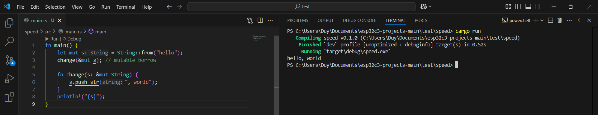

# Learning Rust Programming Language
## Date 24 - 25/3/2025: Ownership, Borrow Checker
We continue with the Rust book learning about ownership - a discipline for ensuring the safety of Rust programs. This is a new and very hard concept so we have to study really carefully to manage our memory.

**The Rust book is very detailed and we have followed it all (with many of references from Youtube, ChatGPT, Rust Forum, etc,.. ) so we try to summary as simple as we can because it is very long.**

### Understanding Stack and Heap
In Rust, we learned that memory is managed through two main areas: **the stack** and **the heap**.

* The **stack** is fast and works like stacking plates — you can only add and remove from the top (last-in, first-out). It's used for data with a **fixed, known size** at compile time.

* The **heap** is for values that are **dynamically sized** or not known until runtime. It’s more flexible but a bit slower, because the program has to **allocate** and **deallocate** memory manually behind the scenes.

Rust makes us more aware of where data lives because that affects **ownership**, **borrowing**, and **performance**.

**Example:**

```rust
fn main() {
    let x = 5;               // Stored on the stack — fixed size integer
    let y = String::from("hello"); // Stored on the heap — dynamic size string

    println!("x = {}", x);   // Copy (simple value, still valid after use)
    println!("y = {}", y);   // Moves ownership of y here
}
```

* `x` is a simple `i32`, so it's stored entirely on the stack.
* `y` is a `String`, which has some data (like a pointer and length) on the stack, but the actual `"hello"` text is stored on the heap.

This example helped us understand why Rust tracks ownership and borrowing — especially when working with heap data — to **prevent bugs like dangling pointers** or **double frees**, which are common in languages like C.

### Ownership Rules
Rust has 3 main ownership rules:

1. **Each value has one owner.**
2. **Only one owner at a time.**
3. **When the owner goes out of scope, the value is dropped (freed automatically).**

Basically, here is what we have to deal with ownership when programming in Rust:

**Scope**
```rust
{
    let s = "hello"; // s is valid here (string literal, fixed size on stack)
    println!("{s}");
}                     // s goes out of scope here
```

* `s` is valid only **inside the curly braces**.
* After that, it’s dropped (cleaned up by Rust).

**`String` and the Heap**

```rust
let mut s = String::from("hello");
s.push_str(", world!"); // We can grow this String!
println!("{s}");
```

* `String` is stored **on the heap**, so it can grow.
* When `s` goes out of scope, Rust **automatically frees** the memory.

**The reason that `String` needs *Heap* is really simple**

Unlike `&str` (string literals) - which is just a reference, `String` is:

* Mutable 
* Dynamically sized 
* Stored on the heap 

Rust tracks who "owns" the memory to **automatically clean it up** when it's no longer needed.

**Ownership Transfer (Move)**

```rust
let s1 = String::from("hello");
let s2 = s1; // Ownership moved to s2
// println!("{s1}");  Error! s1 is no longer valid
println!("{s2}"); //  Works
```

When assign `s1` to `s2`, the ownership moves. We can't use `s1` anymore. This prevents double free errors.

**Drop Happens Automatically**

```rust
{
    let goodbye = String::from("bye!");
    // When this block ends, drop(goodbye) is called automatically
}
```

Rust calls a special function called `drop()` when a value goes out of scope, so you **don’t need to manually free memory** like in C.

**Summary:**

Ownership helps Rust:

* Avoid memory leaks
* Prevent bugs like use-after-free
* Work **without** garbage collection

All this, just by **tracking who owns what**, and **cleaning up** when it’s no longer needed.

Here is an example of using ownership with functions:
```rust
fn main() {
    let s = String::from("hello");  // s comes into scope

    takes_ownership(s);             // s's value moves into the function...
                                    // ... and so is no longer valid here

    let x = 5;                      // x comes into scope

    makes_copy(x);                  // because i32 implements the Copy trait,
                                    // x does NOT move into the function,
    println!("{}", x);              // so it's okay to use x afterward

} // Here, x goes out of scope, then s. But because s's value was moved, nothing
  // special happens.

fn takes_ownership(some_string: String) { // some_string comes into scope
    println!("{some_string}");
} // Here, some_string goes out of scope and `drop` is called. The backing
  // memory is freed.

fn makes_copy(some_integer: i32) { // some_integer comes into scope
    println!("{some_integer}");
} // Here, some_integer goes out of scope. Nothing special happens.
```
**The Result:**


### References and Borrowing
In Rust, instead of transferring ownership every time, we can **borrow** a value using **references**.

#### Rules of Borrowing

1. You can **have either**:

   * **One mutable reference**
   * **OR** multiple immutable references
     ...but **not both at the same time**!

2. References **do not own** the data — they just **point to** it.

**Immutable Reference**

```rust
fn main() {
    let s1 = String::from("hello");

    let len = calculate_length(&s1);

    println!("The length of '{s1}' is {len}.");
}

fn calculate_length(s: &String) -> usize {
    s.len()
}
```


* `&s` is a reference.
* Function borrows `s` — **no ownership is taken**.
* `s` can still be used afterward.

Just imagine you borrow us a pen, after finished using it, you have to give it back because you don't own our pen. 

**Mutable Reference**

```rust
fn main() {
    let mut s = String::from("hello");
    change(&mut s); // mutable borrow

    fn change(s: &mut String) {
        s.push_str(", world");
    }
    println!("{s}");
}
```

* `&mut s` means we’re **borrowing s mutably**.
* Only **one mutable reference** allowed at a time!

**Mixing Mutable and Immutable References (Not Allowed)**

```rust
fn main() {
    let mut s = String::from("hello");

    let r1 = &s;
    let r2 = &s;
    let r3 = &mut s; //Can borrow mutable variables

    println!("{r1}, {r2}, {r3}");
}
```

* You can have **multiple `&` immutable references**, but:
* **No `&mut` mutable reference is allowed at the same time**.

So to fix it, we can use like this.

**Mutable Reference After Immutable Use**

```rust
fn main() {
    let mut s = String::from("hello");

    let r1 = &s;
    println!("{r1}"); // use done here
    let r2 = &mut s;  // no conflict
    r2.push_str(", world");
}
```


* After `r1` is used, it's no longer active.
* So `r2` can safely borrow mutably.

**Why This Matters**

Rust uses these borrowing rules to:

* Prevent **data races**
* Avoid **undefined behavior**
* Let you write fast, safe code **without needing a garbage collector**

And best of all: **it’s all checked at compile time** 

**Summary**

| Type of Ref | How Many Allowed   | Can Modify? | Owns Data? |
| ----------- | ------------------ | ----------- | ---------- |
| Immutable        | Many at a time     | ❌           | ❌          |
| Mutable    | Only one at a time | ✅           | ❌          |
| Owned | Only one           | ✅           | ✅          |

### Slice Type
Think of a **slice** as a **view into a part of a collection** — like pointing to a few pieces of a big cake without owning the cake.

Slices let us reference a **contiguous range** of elements in a collection **without taking ownership**.

**String Slice (`&str`)**

```rust
fn main() {
    let s = String::from("hello world");
    let hello = &s[0..5];     // slice from index 0 to 4
    let world = &s[6..11];    // slice from index 6 to 10

    println!("{hello}, {world}"); // prints: hello, world
}
```

* `&s[0..5]` means: borrow part of the string — from byte 0 up to, but not including, byte 5.
* This doesn’t copy the data, just creates a reference.

**Shortcuts with Ranges**

```rust
let s = String::from("hello");

// Same as &s[0..5]
let slice1 = &s[..];

// From index 3 to end
let slice2 = &s[3..];

// From start to index 3 
let slice3 = &s[..3];
```

These shortcuts make it easier to work with slices quickly.

**Important: Slices are References**

* `&str` is a **string slice**, like `&s[0..5]`
* `&[T]` is a **slice of any type** (not just `str`)

They **do not own** the data. That’s why you **can’t modify through a slice** unless it’s a mutable slice.

**Slicing Arrays**

```rust
fn main() {
    let a = [1, 2, 3, 4, 5];

    let slice = &a[1..4]; // slice contains [2, 3, 4]

    for item in slice {
        println!("{item}");
    }
}
```

* Works the same as string slices, but for arrays.

**Safety: Indexing Must Be In Bounds**

Rust ensures slice ranges are **valid at runtime**. For example:

```rust
let s = String::from("hello");
let part = &s[0..10]; // Error: index out of bounds (string has only 5 bytes)
```

You’ll get a **runtime panic** if the slice goes beyond the data’s length.


**First Word Function Using Slices**

```rust
fn first_word(s: &str) -> &str {
    let bytes = s.as_bytes();

    for (i, &item) in bytes.iter().enumerate() {
        if item == b' ' {
            return &s[..i]; // slice up to space
        }
    }

    &s // no space found, return whole string
}

let s = String::from("hello world");
let word = first_word(&s);

println!("{word}"); // prints: hello
```


We can see that with slice, there is:
* No copying.
* Safe reference.
* Works with `String` or `&str`.

**Summary**

| Feature            | Description                                |
| ------------------ | ------------------------------------------ |
| `&str`             | Borrow part of a string                    |
| `&[T]`             | Borrow part of an array or slice of values |
| No ownership       | Can’t modify unless it’s `&mut`            |
| Efficient and safe | Checked at compile-time and run-time       |

### Compare Rust with C
In C, we have to track and free the memory by yourself. For example:
```c
#include <stdlib.h>
#include <string.h>
#include <stdio.h>

int main() {
    char* s = malloc(6);
    strcpy(s, "hello");
    printf("%s\n", s);
    free(s); // Must remember to do this
}
```
And sometimes, you call double free in C without notice it. But for Rust, memory is manage automatically:
```rust
fn main() {
    let s = String::from("hello");
    println!("{}", s);
} // `s` goes out of scope → memory is freed automatically here!
```
Or in C, pointers are copied rather than move to the other, which make memory management really difficult. 

**In C:**
```c
char* a = malloc(100);
char* b = a; // both a and b point to same memory
free(a);
free(b); // double free! 
```
**In Rust**
```rust
let a = String::from("hello");
let b = a; // a is moved to b → a is no longer valid

println!("{}", a); // compile error: value was moved

```
Or in short: 
| Problem in C             | Rust's Solution                             |
| ------------------------ | ------------------------------------------- |
| Manual memory management | Ownership model + `Drop` trait              |
| Dangling pointers        | Borrow checker disallows invalid references |
| Double free              | Compiler ensures only one owner             |
| Memory leaks             | Automatically cleaned up by RAII            |
| Complex ownership logic  | Clear ownership transfer via move/borrow    |

## Date 26 - 30/3/2025: Concurency and async/await
Concurrency is a really hard concepts, it took us a a long time to understand it correctly. 
### Thread
A **thread** is the smallest unit of execution within a process. Threads allow a program to perform multiple operations concurrently within the same memory space.

**Types:**

* **OS-level Threads**:
  Managed directly by the operating system. The OS schedules them on CPU cores and allows true parallel execution if hardware permits.

* **User-level Threads**:
  Managed in user space by libraries or runtimes. The OS sees the whole application as a single thread. Switching between user threads is done by the application, not the OS.

**Key Properties:**

* Threads within the same process **share memory and resources**.
* Multiple threads can execute code simultaneously (if run on different CPU cores), or take turns (on a single core).

Youtube videos:
* [Threads on Multicore system](https://www.youtube.com/watch?v=5sw9XJokAqw)
* [A program is not a process](https://www.youtube.com/watch?v=7ge7u5VUSbE&t=4s)

### Concurrency and Parallelism
**Concurrency** refers to the composition and management of multiple tasks that can make progress independently. Tasks do **not have to run simultaneously** but are structured to operate without blocking each other.

**Mechanism:**

* On **a single-core CPU**, concurrency is implemented through **context switching**, where the CPU rapidly switches between tasks.
* The illusion of simultaneous execution is created through **efficient scheduling**.

**Example:**
A web server handles multiple requests. Even if it has only one CPU core, it can serve multiple clients by switching between request handlers rapidly. 

--- 

**Parallelism** refers to the actual **simultaneous execution** of multiple tasks on **multiple CPU cores or processors**.

**Mechanism:**

* Requires hardware support (multi-core CPUs).
* The OS or runtime scheduler assigns different threads or processes to different cores, allowing them to run simultaneously.

**Use Case:**

Parallelism is suitable for **CPU-bound tasks**, such as:

* Scientific computations
* Image or video processing
* Machine learning workloads

**Example:**

A machine learning model training process parallelizes matrix operations across 8 CPU cores to accelerate computation.
| Feature         | Concurrency                      | Parallelism                               |
| --------------- | -------------------------------- | ----------------------------------------- |
| Core Idea       | Multiple tasks making progress   | Multiple tasks executing at the same time |
| Hardware Need   | Can work on single core          | Requires multi-core/processor             |
| Execution Model | Task switching                   | Simultaneous execution                    |
| Main Goal       | Responsiveness, structure        | Performance, speed                        |
| Example         | Handling many client requests    | Processing parts of a task in parallel    |
| Related Tools   | Threads, coroutines, async/await | Threads, processes, parallel libraries    |


There is a very good youtube video explaining about concurrency and parallelsim:
* [Concurrency is not what you think](https://www.youtube.com/watch?v=3X93PnKRNUo&t=891s)
* [Concurrency and Parallelism](https://www.youtube.com/watch?v=RlM9AfWf1WU&pp=ygUbY29uY3VycmVuY3kgYW5kIHBhcmFsbGVsaXNt0gcJCY0JAYcqIYzv)

**Key Takeaways:**

* **Concurrency** enables systems to be more **responsive and organized**, especially for I/O-bound tasks.
* **Parallelism** enables systems to **scale performance** across multiple CPU cores for computation-heavy tasks.
* They are **not mutually exclusive** — many modern systems use both simultaneously.
* Choosing between them depends on the **nature of the workload**:

  * Use concurrency for responsiveness and task structure.
  * Use parallelism to improve throughput and speed.
### Asynchronous Programming

**Definition:**

**Asynchronous programming** is a programming paradigm that allows tasks to **pause (await)** while waiting for operations (e.g., I/O) to complete, without blocking the entire program.

**Characteristics:**

* Commonly used in **I/O-bound scenarios**, such as:

  * Reading from disk
  * Network requests
  * Database access
* Achieves **non-blocking execution** with fewer threads, often just one.

**Mechanism:**

* Uses **event loops** (e.g., in JavaScript, Python `asyncio`) and **callbacks** or `async/await` syntax.
* Rather than blocking a thread during waiting, the task **yields control** and resumes when the awaited operation completes.

**Example:**

A program downloads a file from the internet and, while waiting for the download, cpu processes user input or other tasks.

There is a video talking very detailed about this topic:
* [Asynchronous vs Multithreading and Multiprocessing Programming (The Main Difference)](https://www.youtube.com/watch?v=0vFgKr5bjWI&t=76s&ab_channel=HusseinNasser)

### Race Condition
A **data race** occurs when two or more threads:

* Access the **same memory location**,
* At least one of the accesses is a **write**,
* And the accesses are **not synchronized** (i.e., no locking or coordination).

This leads to **undefined behavior**, including:

* Corrupted memory
* Incorrect program output
* Random crashes

**Why Are Data Races a Problem?**

Languages like **C++** and **Java** allow direct access to shared memory. Without **explicit synchronization**, threads can interfere with each other’s operations.

For example:

```cpp
int counter = 0;

void increment() {
    counter++; // Not thread-safe
}
```

If two threads execute `increment()` at the same time, the result may be wrong (e.g., incremented once instead of twice).

**How they Prevent Data Races**

To avoid data races, use **mutual exclusion mechanisms** such as:

* **Locks** (Allow Multithreading)
* **Semaphores** (Control shared resources)
* **Atomic operations** (Single, indivisible unit)

### Async/await 
Most **microcontrollers** (like those in embedded systems) have:

* Only **one core**
* Very **limited RAM and CPU cycles**
* No operating system (or a very minimal one)

Therefore:

* **Thread-based parallelism** is **expensive or infeasible** (no OS-level thread scheduler).
* **Async/await** is **lightweight**, requiring no multiple stacks or heavy context switches.

**Benefits of Async/Await:**

* Allows suspending a task **without blocking the CPU**
* Resumes only when needed (e.g., after I/O or delay)
* Uses **state machines** instead of real threads

Hence, for **I/O-bound and timing-sensitive** microcontroller tasks (e.g., sensors, serial communication), async/await provides **efficient concurrency**.

### Learning async/await in Rust programming language
We follow the chapter 17 of rust book. 

#### Futures and Async in Rust

* **Futures** represent values that are *not ready yet* but *will be* in the future—like a task waiting to finish.
* In Rust, a **future** is just a type that implements the `Future` trait.
* Futures are *lazy*—they don’t run until you *`await`* them.

#### Async and await

* Use `async` to define functions or code blocks that do work in the background.
* Inside an `async` function, use `await` to pause and wait for a future to finish.
* Example:

  ```rust
  async fn fetch_data() {
      let result = do_something_async().await;
  }
  ```

**How It Works**

* An `async fn` returns a future automatically.
* The compiler transforms this:

  ```rust
  async fn fetch_title() -> Option<String> { ... }
  ```

  into:

  ```rust
  fn fetch_title() -> impl Future<Output = Option<String>> { ... }
  ```

---

**Example: Get a Webpage Title**

```rust
use trpl::Html;

async fn page_title(url: &str) -> Option<String> {
    let response = trpl::get(url).await;
    let text = response.text().await;
    Html::parse(&text)
        .select_first("title")
        .map(|el| el.inner_html())
}
```

* This function:

  1. Fetches a webpage.
  2. Waits for the response (`await`).
  3. Parses HTML to find the `<title>` tag.

---

**Using Async in `main`**

* Rust doesn’t allow `async fn main()` by default.
* You must use an **async runtime** (like `tokio` or `trpl::run`) to run async code in `main`.

Example:

```rust
fn main() {
    trpl::run(async {
        let title = page_title("https://example.com").await;
        println!("{:?}", title);
    });
}
```
**Summary**

* `async` marks code that can be paused and resumed.
* `await` waits for futures to finish.
* Futures don’t run unless awaited.
* Use a runtime to run your async code.

#### Concurrency with Async
**Running Two Tasks at the Same Time**

In Chapter 16, we used `thread::spawn`. Now we’ll use `trpl::spawn_task`, which works with async code. It looks like this:

```rust
use std::time::Duration;

fn main() {
    trpl::run(async {
        trpl::spawn_task(async {
            for i in 1..10 {
                println!("hi number {i} from the first task!");
                trpl::sleep(Duration::from_millis(500)).await;
            }
        });

        for i in 1..5 {
            println!("hi number {i} from the second task!");
            trpl::sleep(Duration::from_millis(500)).await;
        }
    });
}
```

This code runs two loops at the same time. Each prints messages with a 0.5-second pause between them.

**Waiting for the First Task to Finish**

If we want the first task to finish completely before the program exits, we **save its handle** and `.await` it:

```rust
let handle = trpl::spawn_task(async {
    // first task
});

for i in 1..5 {
    // second task
}

handle.await.unwrap();  // wait for first task to complete
```

Just like how we used `.join()` with threads.

**No Need to Spawn a Task**

Actually, since `async` blocks are just values (called **futures**), we can run two of them together with `trpl::join`:

```rust
let fut1 = async { /* first loop */ };
let fut2 = async { /* second loop */ };

trpl::join(fut1, fut2).await;  // runs both to completion
```

Unlike threads (which can run unpredictably), `trpl::join` is **fair**—it switches between both tasks regularly.

**Sending Data with Channels (Async Version)**

Just like before, we can send data between tasks using channels. The async version looks like this:

```rust
let (tx, mut rx) = trpl::channel();

tx.send("hi".to_string()).unwrap();
let received = rx.recv().await.unwrap();
println!("Got: {received}");
```

Here:

* `recv().await` **waits without blocking**.
* `send()` sends immediately.

To send multiple values with a delay:

```rust
let vals = vec!["hi", "from", "the", "future"];

for val in vals {
    tx.send(val.to_string()).unwrap();
    trpl::sleep(Duration::from_millis(500)).await;
}

while let Some(value) = rx.recv().await {
    println!("received '{value}'");
}
```

This listens for all messages sent. The `while let` loop keeps receiving until the sender is done.

**Summary**

* `spawn_task` is like `thread::spawn` but for async.
* Use `.await` to wait for tasks or sleeps to finish.
* `trpl::join` runs two async tasks fairly.
* `trpl::channel` helps pass data between tasks, just like thread channels but async.
* Async doesn't block the OS; it lets other tasks run while waiting.

#### Working with Futures
A `Future` in Rust is like a *placeholder* for a value that will be available *later*.
It’s used for *asynchronous* tasks — things that take time, like downloading a file.

```rust
async fn learn() -> u8 {
    42
}
```

Calling `learn()` gives a **Future** — not the value `42` yet!

To get the result, you `await` it:

```rust
let answer = learn().await;
```

**Spawning Tasks**

We can run async tasks *in parallel* using a task **spawner**, like `trpl::spawn_task`.

```rust
use trpl::spawn_task;

spawn_task(async {
    // This runs in the background
    println!("Async task running!");
});
```

**Sleeping in Async**

We can pause an async task with `trpl::sleep`.

```rust
use trpl::sleep;
use std::time::Duration;

sleep(Duration::from_secs(1)).await; // waits 1 second
```

This doesn't block the whole program — only that async task pauses.

**Joining Tasks**

Want to wait for multiple tasks to finish? Use `trpl::join`.

```rust
use trpl::{join, sleep};
use std::time::Duration;

async fn one() {
    sleep(Duration::from_secs(1)).await;
    println!("one done");
}

async fn two() {
    sleep(Duration::from_secs(2)).await;
    println!("two done");
}

join!(one(), two()); // both run at the same time
```

Both tasks start at once, but the program waits for both to finish.

**Sending Messages (Async Channels)**

Tasks can send messages to each other using `trpl::channel`.

```rust
use trpl::channel;

let (sender, receiver) = channel();

spawn_task(async move {
    sender.send("hello").await;
});

let msg = receiver.recv().await;
println!("Received: {}", msg);
```

This is like a walkie-talkie between tasks. Great for coordinating them.

**Summary**

* `async fn` gives a **Future**.
* `.await` waits for the result.
* `spawn_task` runs a task in parallel.
* `sleep()` pauses without blocking others.
* `join!` waits for many tasks.
* `channel()` lets tasks communicate.

That's is all for basic async/await in Rust