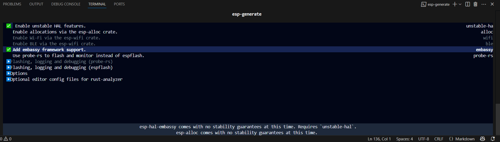
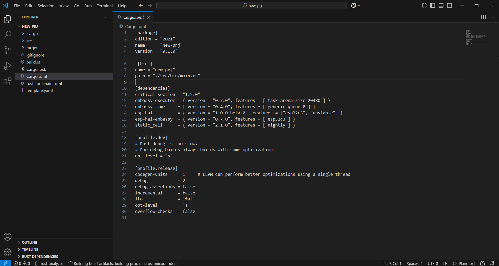

# Rust\_Embed\_02: Embassy Framework + Lab Work 1 – Soldering Basics

## 1. 📘 Introduction to Embassy in Rust

**Embedded systems** are microcontroller-based devices with limited computing resources. Traditionally programmed in C or C++, these systems benefit greatly from Rust’s memory safety and concurrency model.

**Embassy** is a modern embedded async framework for Rust. It makes asynchronous programming practical and efficient in no\_std embedded environments.

### Key Features of Embassy

* Async/Await support in no\_std
* Cooperative multitasking
* Power-efficient task scheduling
* Async hardware peripheral drivers
* Timers, delays, and scheduling

> Traditional embedded development uses interrupt-driven logic or RTOSes. Embassy introduces structured, composable async multitasking.

## 2. Core Concepts of Embassy

To use Embassy effectively, you must understand several foundational concepts. While `async`/`await` are already familiar, the following ideas deserve special attention:

### 2.1 What Is Embassy and How It Works Without RTOS?

Embassy provides a way to run asynchronous tasks **without needing a traditional RTOS**. Instead of preemptive threads, it relies on **cooperative multitasking**:

* Tasks must explicitly `await` to yield control.
* Embassy uses a lightweight **executor** to schedule tasks.
* This design avoids context-switch overhead and is more predictable.

Embassy is compatible with `no_std`, making it highly suitable for constrained microcontrollers.

### 2.2 What Is an Executor?

The **executor** is a runtime system that polls async tasks and schedules them efficiently:

* Only one task runs at a time per core.
* When an async task hits `.await`, the executor can run another task.
* This avoids busy-waiting and makes multitasking efficient.

Example:

```rust
#[embassy_executor::task]
async fn task1() {
    loop {
        do_work().await;
    }
}
```

### 2.3 Tasks and Spawner

A **task** is an `async fn` annotated with `#[embassy_executor::task]`. These are launched using a `Spawner` in `main`:

```rust
#[embassy_executor::task]
async fn blink_task() {
    loop {
        Timer::after(Duration::from_millis(500)).await;
    }
}

#[main]
async fn main(spawner: Spawner) {
    spawner.spawn(blink_task()).unwrap();
}
```

### 2.4 Time and Delays

Use `embassy-time` for accurate delays without blocking:

```rust
use embassy_time::{Timer, Duration};
Timer::after(Duration::from_secs(1)).await;
```

This avoids power-wasting busy-waiting.

### 2.5 How Embassy Configures Peripherals for Async

Embassy depends on HAL crates like `esp-hal` to:

* Configure timers for async delays.
* Setup GPIO/UART/I2C with interrupt-based async drivers.
* Provide traits and drivers compatible with Embassy’s task system.

You must select Embassy-compatible HAL features:

```toml
esp-hal = { version = "0.17.0", features = ["esp32c3", "embassy", "embassy-time-timg0"] }
```

### 2.6 Interrupts Integration

Embassy integrates hardware interrupts with async code:

* Drivers internally attach interrupts to wake tasks.
* No manual interrupt code is needed for most use cases.

### 2.7 Static Memory Requirements

Rust’s async model is **stackless**:

* Each `async fn` has a state machine stored in memory.
* Use `static` memory for tasks that live forever.

Example:

```rust
static EXECUTOR: Forever<Executor> = Forever::new();
```

### 2.8 Soldering Skills Matter!

Although not software-specific, **soldering** is an essential hardware skill for embedded engineers. You'll need it to:

* Solder headers to ESP32 boards
* Connect sensors and modules (I2C, SPI, UART)
* Ensure stable prototype hardware

Invest in a good soldering iron, learn to tin wires, and practice on prototype boards!

## 3. Setting Up the Embassy Development Environment for ESP32-C3

We already install the rust toolchain so to add `embassy`, we can do it with `cargo`:
```rust
esp-generate --chip esp32c3 hello-oled
```
This will open a screen asking you to select options.

* Select the option "Enable unstable HAL features"
* Then, select the option "Adds embassy framework support".

Just save it by pressing "s" in the keyboard.


### 3.1 Configure Cargo for ESP32-C3
When succesfully generate it, in `Cargo.toml`, we can see that embassy is already be added:

### 3.2 Project Dependencies Overview

`Cargo.toml` correctly includes:

* Embassy Executor + Time
* `esp-hal` and `esp-hal-embassy`
* Async SSD1306 OLED driver

With these in place, you're ready to build a multitasking async embedded app on ESP32-C3.

## 4. Writing a Practical Embassy App: OLED Display Task
We follow the tutorial of [`impl Rust`](https://esp32.implrust.com/index.html) but modified it for esp32c3 super mini. This is the same blinky version of async/await but we add the embassy to test it first
### Key Objectives:

* Initialize I2C peripheral
* Set up led to test for blinky

This code sets up the blinky asynchronously.

```rust
#![no_std]
#![no_main]
#![feature(type_alias_impl_trait)]

use esp_backtrace as _;
use esp_hal::{clock::ClockControl, embassy, peripherals::Peripherals, prelude::*, system::SystemControl, IO};
use embassy_executor::Spawner;
use embassy_time::{Timer, Duration};

#[main]
async fn main(_spawner: Spawner) {
    let peripherals = Peripherals::take();
    let system = SystemControl::new(peripherals.SYSTEM);
    let clocks = ClockControl::max(system.clock_control);
    let _timer = embassy::init(&clocks);

    let io = IO::new(peripherals.GPIO, peripherals.IO_MUX);
    let mut led = io.pins.gpio2.into_push_pull_output();

    loop {
        led.set_high().unwrap();
        Timer::after(Duration::from_secs(1)).await;
        led.set_low().unwrap();
        Timer::after(Duration::from_secs(1)).await;
    }
}
```

### ✅ Explanation

* `gpio2.into_push_pull_output()` sets up GPIO5 as output.
* `set_high()` turns LED on, `set_low()` turns it off.
* Delay is async and non-blocking using `Timer::after`.

Result is the same as version without `embassy`

## 5. Diving Deeper: Embassy Features

### 5.1 Timers

```rust
Timer::after(Duration::from_secs(2)).await;
```
This line suspends the async task for 2 seconds without blocking the system. Embassy’s Timer lets you implement power-efficient delays.

### 5.2 GPIO

```rust
let mut led = IO.pins.gpio5.into_push_pull_output();
led.set_high().unwrap();
```
* `gpio2.into_push_pull_output()` sets GPIO2 as a digital output pin.

* `set_high()` turns the pin to HIGH level (3.3V), which turns on an LED (assuming active-high wiring).

* `unwrap()` is used here to panic if the pin fails to set, which is rare for GPIO.
### 5.3 UART

```rust
let mut serial = UartTxRx::new(peripherals.UART0, ...);
serial.write_bytes(b"Hello").await.unwrap();
```
* `UartTxRx::new(...)` creates a UART peripheral for transmit/receive.

* `write_bytes()` sends data asynchronously.

* `await` lets the task yield while the data is transmitted.
### 5.4 Tasks and Spawner

```rust
#[embassy_executor::task]
async fn blink_task() {
    loop {
        // toggle LED
        Timer::after(Duration::from_millis(500)).await;
    }
}

#[main]
async fn main(spawner: Spawner) {
    spawner.spawn(blink_task()).unwrap();
}
```

* `#[embassy_executor::task]` marks an async function to be managed by the Embassy executor.

* `loop` makes the task run forever.

* `Timer::after(...)` is used for a 500ms delay between operations.

* `spawner.spawn(...)` launches the async task from main().
## 6. Follow the `impl Rust` tutorial
This tutorial is for esp32 devkit, not esp32c3 so we have to modified the code and also `Cargo.toml`. It's not that hard so we have done it, also we have done it (Just copy - paste and test a litlle)

### Understanding oled example

* Initializing peripherals with `esp-hal` and Embassy support.
* Creating Embassy-compatible I2C interface.
* Setting up and asynchronously driving a monochrome OLED display using the `ssd1306` driver.
* Using the `embedded-graphics` ecosystem to draw primitives, text, or images on screen.

#### Setup Embassy + HAL

We use Embassy's executor (`embassy-executor`) and time (`embassy-time`) to run tasks and manage delays. We configure `esp-hal` with Embassy support, including the `esp-hal-embassy` glue crate that bridges Embassy and `esp-hal` peripherals.

#### Create an Async Task for OLED Drawing

We likely use the `ssd1306` driver in `async` mode, which allows writing to the screen without blocking your embedded system. Your I2C peripheral is probably created using `esp-hal` and passed to the SSD1306 display interface using `display-interface-i2c`.

**The code**
```rust
#![no_std]
#![no_main]

use embassy_executor::Spawner;
use embassy_time::{Duration, Timer};
use embedded_graphics::mono_font::{ascii::FONT_6X10, MonoTextStyleBuilder};
use embedded_graphics::pixelcolor::BinaryColor;
use embedded_graphics::prelude::Point;
use embedded_graphics::prelude::*;
use embedded_graphics::text::{Baseline, Text};
use esp_hal::timer::timg::TimerGroup;
use esp_hal::{clock::CpuClock, time::Rate};
use ssd1306::mode::DisplayConfigAsync;
use ssd1306::{
    prelude::DisplayRotation, size::DisplaySize128x64, I2CDisplayInterface, Ssd1306Async,
};

#[panic_handler]
fn panic(_: &core::panic::PanicInfo) -> ! {
    loop {}
}

#[esp_hal_embassy::main]
async fn main(_spawner: Spawner) {
    // generator version: 0.3.1

    let config = esp_hal::Config::default().with_cpu_clock(CpuClock::max());
    let peripherals = esp_hal::init(config);

    let timer0 = TimerGroup::new(peripherals.TIMG1);
    esp_hal_embassy::init(timer0.timer0);

    let i2c_bus = esp_hal::i2c::master::I2c::new(
        peripherals.I2C0,
        esp_hal::i2c::master::Config::default().with_frequency(Rate::from_khz(400)),
    )
    .unwrap()
    .with_scl(peripherals.GPIO9)
    .with_sda(peripherals.GPIO8)
    .into_async();

    let interface = I2CDisplayInterface::new(i2c_bus);

    // initialize the display
    let mut display = Ssd1306Async::new(interface, DisplaySize128x64, DisplayRotation::Rotate0)
        .into_buffered_graphics_mode();
    display.init().await.unwrap();

    let text_style = MonoTextStyleBuilder::new()
        .font(&FONT_6X10)
        .text_color(BinaryColor::On)
        .build();

    Text::with_baseline("Hello, Rust!", Point::new(0, 16), text_style, Baseline::Top)
        .draw(&mut display)
        .unwrap();

    display.flush().await.unwrap();

    loop {
        Timer::after(Duration::from_secs(1)).await;
    }
}
```
`Cargo.toml`
```toml
[package]
edition = "2021"
name    = "hello-oled"
version = "0.1.0"

[[bin]]
name = "hello-oled"
path = "./src/bin/main.rs"

[dependencies]
critical-section = "1.2.0"
embassy-executor = { version = "0.7.0", features = ["task-arena-size-20480"] }
embassy-time     = { version = "0.4.0", features = ["generic-queue-8"] }
esp-hal          = { version = "1.0.0-beta.0", features = ["esp32c3", "unstable"] }
esp-hal-embassy  = { version = "0.7.0", features = ["esp32c3"] }
static_cell      = { version = "2.1.0", features = ["nightly"] }
defmt = "0.3.6"
defmt-rtt = "0.4.0"
embedded-hal = "1.0.0"
display-interface = "0.5.0"
display-interface-i2c = "0.5.0"
display-interface-spi = "0.5.0"
embedded-graphics = "0.8.1"
embedded-hal-async = { version = "1.0.0", optional = true }
maybe-async-cfg = "=0.2.4"
ssd1306 = { git = "https://github.com/rust-embedded-community/ssd1306.git", rev = "f3a2f7aca421fbf3ddda45ecef0dfd1f0f12330e", features = [
    "async",
] }
tinybmp = "0.6.0"
tinygif = "0.0.4"
[profile.dev]
# Rust debug is too slow.
# For debug builds always builds with some optimization
opt-level = "s"

[profile.release]
codegen-units    = 1     # LLVM can perform better optimizations using a single thread
debug            = 2
debug-assertions = false
incremental      = false
lto              = 'fat'
opt-level        = 's'
overflow-checks  = false

```
### 📦 Crates That Make This Work

| Crate                   | Purpose                        |
| ----------------------- | ------------------------------ |
| `ssd1306`               | Async SSD1306 OLED driver      |
| `display-interface-i2c` | I2C communication for displays |
| `embedded-graphics`     | Draw text and shapes on screen |
| `embassy-executor`      | Run tasks cooperatively        |
| `esp-hal`               | Access ESP32 peripherals       |

**Debugging and Logging**

### defmt and RTT (Optional)

WE could use `defmt` with `esp-println` or ESP logging macros for debug prints.

### Example:

```toml
[dependencies]
esp-println = "0.5.0"
```

```rust
esp_println::println!("Debug info: {}");
```

## 7. The result:


## 8. Soldering Techniques
This skill we have learned from the begin of semester, for more detail, please read [Soldering Techniques](ky_thuat_han.md)