# Sensors 
## MAX30102 
### General Description
-  The MAX30102 is an integrated pulse oximetry and 
heart-rate monitor module. It includes internal LEDs, 
photodetectors, optical elements, and low-noise electronics 
with ambient light rejection. The MAX30102 provides a 
complete system solution to ease the design-in process 
for mobile and wearable devices.

- Behind the window on one side, the MAX30102 has two LEDs – a RED and an IR LED. On the other side is a very sensitive photodetector. The idea is that you shine a single LED at a time, detecting the amount of light shining back at the detector, and, based on the signature, you can measure blood oxygen level and heart rate.
    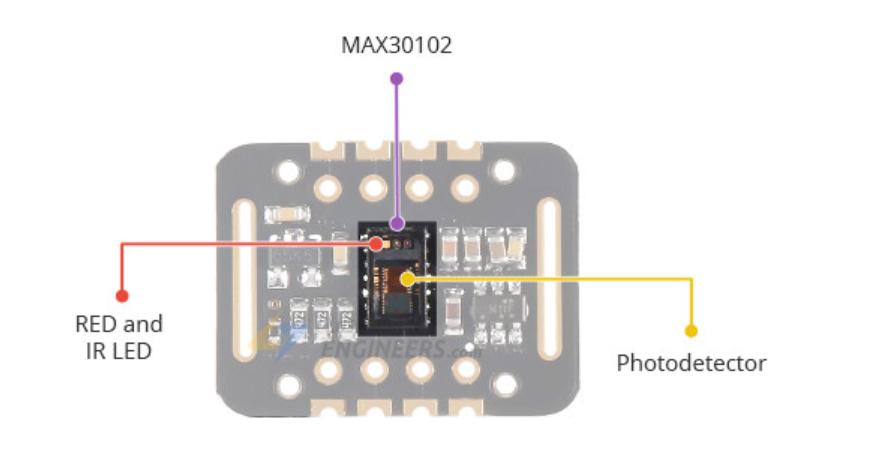

- The MAX30102 chip requires two different supply voltages: 1.8V for the IC and 3.3V for the RED and IR LEDs. So the module comes with 3.3V and 1.8V regulators.
    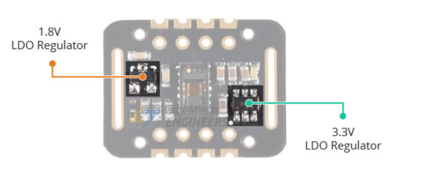

- On the back of the PCB you’ll find a solder jumper that can be used to select between 3.3V and 1.8V logic level. You can also select 1.8V logic level as per your requirement. This allows you to connect the module to any microcontroller with 5V, 3.3V, even 1.8V level I/O.
    
    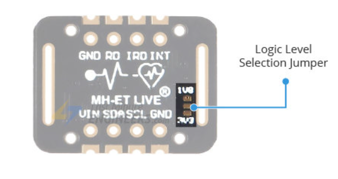

- One of the most important features of the MAX30102 is its low power consumption: the MAX30102 consumes less than 600μA during measurement. Also it is possible to put the MAX30102 in standby mode, where it consumes only 0.7μA. This low power consumption allows implementation in battery powered devices such as handsets, wearables or smart watches.

### On-Chip Temperature Sensor
- The MAX30102 has an on-chip temperature sensor that can be used to compensate for the changes in the environment and to calibrate the measurements.

- This is a reasonably precise temperature sensor that measures the ‘die temperature’ in the range of -40˚C to +85˚C with an accuracy of ±1˚C.

### I2C Interface
- The module uses a simple two-wire I2C interface for communication with the microcontroller. It has a fixed I2C address: 0xAEHEX (for write operation) and 0xAFHEX (for read operation).

### FIFO Buffer
- The MAX30102 embeds a FIFO buffer for storing data samples. The FIFO has a 32-sample memory bank, which means it can hold up to 32 SpO2 and heart rate samples. The FIFO buffer can offload the microcontroller from reading each new data sample from the sensor, thereby saving system power.

### Interrupts
The MAX30102 can be programmed to generate an interrupt, allowing the host microcontroller to perform other tasks while the data is collected by the sensor. The interrupt can be enabled for 5 different sources:
- Power Ready: triggers on power-up or after a brownout condition.
- New Data Ready: triggers after every SpO2 and HR data sample is collected.
- Ambient Light Cancellation: triggers when the ambient light cancellation function of the SpO2/HR photodiode reaches its maximum limit, affecting the output of the ADC.
- Temperature Ready: triggers when an internal die temperature conversion is finished.
- FIFO Almost Full: triggers when the FIFO becomes full and future data is about to be lost.
    

The INT line is an open-drain, so it is pulled HIGH by the onboard resistor. When an interrupt occurs the INT pin goes LOW and stays LOW until the interrupt is cleared.

### Technical Specifications
| **Parameters**           | **Specifications**                              |
|----------------------------|------------------------------------------|
| **Power supply**           | 3.3V to 5.5V                              |
| **Current draw**           | ~600μA (during measurements)             |
|                            | ~0.7μA (during standby mode)             |
| **Red LED Wavelength**     | 660nm                                    |
| **IR LED Wavelength**      | 880nm                                    |
| **Temperature Range**      | -40°C to +85°C                           |
| **Temperature Accuracy**   | ±1°C                                     |

### How MAX30102 Pulse Oximeter and Heart Rate Sensor Works?
The MAX30102, or any optical pulse oximeter and heart-rate sensor for that matter, consists of a pair of high-intensity LEDs (RED and IR, both of different wavelengths) and a photodetector. The wavelengths of these LEDs are 660nm and 880nm, respectively.
    

The MAX30102 works by shining both lights onto the finger or earlobe (or essentially anywhere where the skin isn’t too thick, so both lights can easily penetrate the tissue) and measuring the amount of reflected light using a photodetector. This method of pulse detection through light is called Photoplethysmogram.

The working of MAX30102 can be divided into two parts: Heart Rate Measurement and Pulse Oximetry (measuring the oxygen level of the blood).

#### Heart Rate Measurement
- The oxygenated hemoglobin (HbO2) in the arterial blood has the characteristic of absorbing IR light. The redder the blood (the higher the hemoglobin), the more IR light is absorbed. As the blood is pumped through the finger with each heartbeat, the amount of reflected light changes, creating a changing waveform at the output of the photodetector. As you continue to shine light and take photodetector readings, you quickly start to get a heart-beat (HR) pulse reading.
    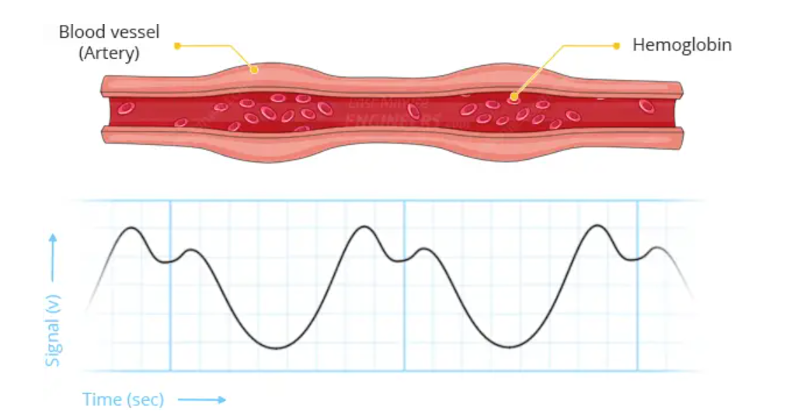
#### Pulse Oximetry
- Pulse oximetry is based on the principle that the amount of RED and IR light absorbed varies depending on the amount of oxygen in your blood. The following graph is the absorption-spectrum of oxygenated hemoglobin (HbO2) and deoxygenated hemoglobin (Hb).
    

- As you can see from the graph, deoxygenated blood absorbs more RED light (660nm), while oxygenated blood absorbs more IR light (880nm). By measuring the ratio of IR and RED light received by the photodetector, the oxygen level (SpO2) in the blood is calculated.

### MAX30102 Module Pinout
    

- VIN is the power pin. You can connect it to 3.3V or 5V output from your ESP32.
- SCL is the I2C clock pin, connect to your ESP32’s I2C clock line.
- SDA is the I2C data pin, connect to your ESP32’s I2C data line.
- INT The MAX30102 can be programmed to generate an interrupt for each pulse. This line is open-drain, so it is pulled HIGH by the onboard resistor. When an interrupt occurs the INT pin goes LOW and stays LOW until the interrupt is cleared.
- IRD The MAX30102 integrates an LED driver to drive LED pulses for SpO2 and HR measurements. Use this if you want to drive the IR LED yourself, otherwise leave it unconnected.
- RD pin is similar to the IRD pin, but is used to drive the Red LED. If you don’t want to drive the red LED yourself, leave it unconnected.
- GND is the ground.

### 📊 MAX30102 System Diagram – Detailed Explanation

The **MAX30102** is an integrated optical sensor used to measure **heart rate** and **blood oxygen saturation (SpO₂)**. The following system diagram illustrates the **full operation flow** from the controlling software to the optical signal processing and data output.

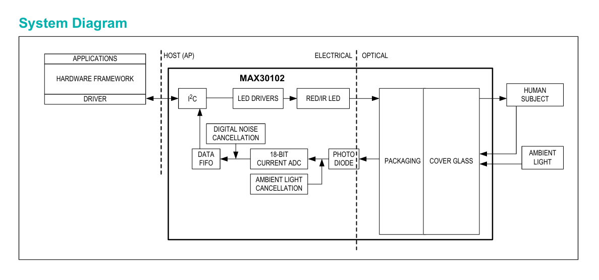

---

#### 🧩 1. Main Functional Blocks in the Diagram

##### **A. HOST (Application Processor)**

The HOST is the main controller device (e.g., a microcontroller or processor in a smartwatch). It includes 3 layers:

- **APPLICATIONS**:  
  User-level software that displays measured values such as heart rate, SpO₂, or plots PPG waveforms.

- **HARDWARE FRAMEWORK**:  
  Middleware layer responsible for handling hardware communication (I²C, power, device configuration).

- **DRIVER**:  
  Low-level driver library to interface with the MAX30102 via **I²C communication**.

---

##### **B. MAX30102 (Main Sensing Block)**

The MAX30102 integrates all necessary components for detecting and processing biophotonic signals. It includes:

###### **1. I²C Interface**
- Enables communication between the **HOST and the sensor**.
- I²C is a two-wire serial protocol (SDA and SCL).

###### **2. LED Drivers + RED/IR LEDs**
- **LED drivers** control the brightness and timing of the LEDs.
- **Red LED (660nm)** and **Infrared LED (IR - 880nm)** emit light through human tissue.
- Light absorption varies with oxygenated and deoxygenated blood – the basis for SpO₂ measurement.

###### **3. Photodiode**
- Captures the **reflected light** from biological tissue after partial absorption by blood.
- Light intensity varies with **pulse and blood oxygenation level**.

###### **4. 18-bit Current ADC**
- Converts the photodiode’s current into a **high-resolution 18-bit digital signal**.
- Ensures accurate readings of weak optical signals.

###### **5. Ambient Light Cancellation**
- Ambient light (e.g., room lighting, sunlight) may interfere with measurements.
- This block **removes unwanted background light**, preserving only the bio-optical signal.

###### **6. Digital Noise Cancellation**
- Eliminates high-frequency noise from vibration, hand movement, or electronic interference.
- Produces clean, reliable data for analysis.

###### **7. Data FIFO (First-In, First-Out Buffer)**
- Temporarily stores digitized measurement data before transmission to the host.
- Allows continuous sampling without data loss.

---

##### **C. Optical Interface**

###### **1. Packaging + Cover Glass**
- Encapsulation and protective layer for the sensor.
- Ensures proper direction of LED light and accurate photodiode reception.
- Protects against dust, moisture, and optical interference.

###### **2. Human Subject**
- A human body part (typically a fingertip, wrist, or earlobe) is placed on the sensor.
- Blood and tissue partially absorb the emitted light → creating a biological signal.

###### **3. Ambient Light**
- External light sources (e.g., the sun or room lights) affect sensor readings.
- Mitigated by the **Ambient Light Cancellation** block for accurate results.

---

#### 🔁 2. Overall Operational Workflow

1. **The host configures the MAX30102** via the I²C interface (e.g., sets sampling rate, LED mode).
2. **LEDs emit light** through the skin using red and IR wavelengths.
3. **Blood absorbs part of the light** depending on heart rate and oxygenation.
4. **Photodiode detects reflected light** from tissue.
5. **Current generated is converted into digital signals** by the 18-bit ADC.
6. **Signals are processed**:
   - Ambient light is removed.
   - Electronic noise is cancelled.
7. **Clean data is stored in the FIFO buffer**.
8. **Host retrieves data via I²C** for further processing or display.

---

#### ✅ 3. Real-World Applications

- Smartwatches with heart rate monitoring.
- Pulse oximeters for measuring blood oxygen.
- Wearable health monitors.
- Biomedical research and personal fitness tracking devices.

---

### 📌 Summary

The MAX30102 is a powerful integrated sensor capable of:
- Detecting biophotonic signals via optical means.
- Internally processing signals (noise reduction, background light cancellation).
- Communicating easily with microcontrollers via I²C.
- Widely used in wearables and personal health monitoring devices.

### Functional Diagram 
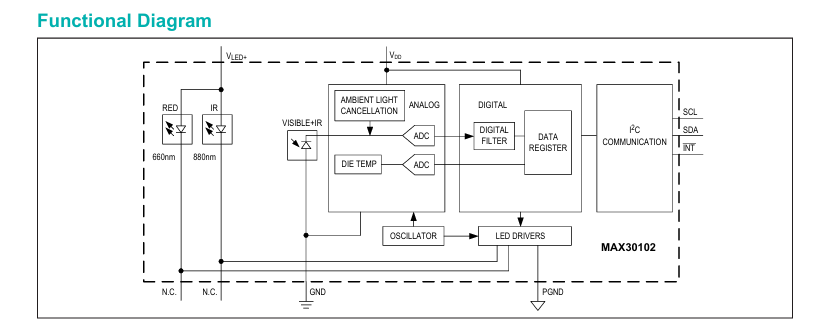
### 🔧 MAX30102 Functional Diagram – In-Depth Explanation

The **Functional Diagram** of the MAX30102 provides a lower-level internal view of how the sensor's hardware components are structured and interact. Unlike the high-level system diagram, this shows the **signal flow**, **conversion stages**, and **embedded control logic**.

---

#### 📌 Overview

MAX30102 integrates:
- Red (660nm) and IR (880nm) LEDs
- A photodetector
- Low-noise analog signal processing
- High-resolution ADC
- Ambient light cancellation
- Digital filters
- I²C communication interface

---

#### 🧩 Main Sections in the Diagram

##### **1. Optical Emitters: RED and IR LEDs**
- **RED LED (660nm)** and **IR LED (880nm)** are used to illuminate human tissue.
- These are externally connected to **VLED+** and controlled internally by LED drivers.
- **N.C.** pins indicate **Not Connected** — reserved or unused pins.

---

##### **2. Optical Receiver: Photodiode (Visible + IR Band)**
- The **photodiode** receives reflected light from the skin (both visible and IR components).
- This light includes:
  - **Reflected RED/IR LED light** (contains heart rate and SpO₂ info).
  - **Ambient light** (which must be cancelled).
- Connected to the **Ambient Light Cancellation** block and **Die Temperature Sensor**.

---

##### **3. Analog Front End (AFE)**

###### a. **Ambient Light Cancellation**
- Removes **interference caused by external light** (room lights, sunlight).
- Ensures that only light from the controlled LEDs is processed.

###### b. **ADC (Analog-to-Digital Converter)**
- Converts the filtered analog current from the photodiode into a digital signal.
- There are two ADCs:
  - One for optical signal.
  - One for **Die Temperature Sensor**.

###### c. **Die Temperature Sensor**
- Measures internal chip temperature to help **compensate for thermal drift** or calibration.

---

##### **4. Digital Signal Processing**

###### a. **Digital Filter**
- Filters out electronic and movement noise.
- Enhances signal quality before storage and transmission.

###### b. **Data Register**
- Stores processed data ready for transfer to the host device.
- Data includes:
  - IR/Red intensity values
  - Die temperature readings

---

##### **5. LED Drivers + Oscillator**
- **Oscillator** provides the clock signals for timing-sensitive operations.
- **LED Drivers**:
  - Control the pulse width, intensity, and timing of RED/IR LEDs.
  - Help modulate light pulses for synchronous detection with ADCs.

---

##### **6. I²C Communication Block**
- Interface through **SCL (clock)** and **SDA (data)** lines.
- Used to configure the sensor, read data registers, and control operation modes.
- **INT (Interrupt)** pin signals to the host when data is ready or an event occurs.

---

#### 🔁 Signal Flow Summary

1. **RED/IR LEDs** emit light through skin.
2. **Photodiode** detects reflected light.
3. Signal enters **Ambient Light Cancellation** to remove noise.
4. **Analog signal** is converted by **ADC** into a digital format.
5. Data passes through **Digital Filter** for smoothing.
6. Final output is stored in the **Data Register**.
7. Host retrieves data via **I²C** (SDA/SCL), optionally responding to **INT**.

---

#### ⚙️ Key External Pins and Connections

| Pin      | Function                                 |
|----------|------------------------------------------|
| VLED+    | Power supply for LEDs                    |
| VDD      | Core power supply for the IC             |
| GND      | Ground connection                        |
| PGND     | Power ground (used for LEDs)             |
| SDA      | I²C serial data                          |
| SCL      | I²C serial clock                         |
| INT      | Interrupt signal to the host             |
| N.C.     | Not connected                            |

---

#### ✅ Use Cases

This functional design allows MAX30102 to operate effectively in:
- Smartwatches and fitness trackers
- Clinical oximeters
- Home health monitoring systems
- Biomedical research equipment

---

#### 📌 Conclusion

The **Functional Diagram** of MAX30102 provides insights into its:
- Internal analog and digital signal processing path
- Light source control and ambient cancellation
- Efficient I²C interface with FIFO buffer design
- Integrated features like temperature sensing and filtering

This makes MAX30102 a **complete, compact, and accurate PPG sensor** ideal for wearable and portable applications.

### Dependency used in Rust coding 
- max3010x = "=0.2.0"
- Rust MAX3010x High-Sensitivity Pulse Oximeter and Heart-Rate Sensor for Wearable Health Driver
- This is a platform agnostic Rust driver for the MAX3010x high-sensitivity pulse oximeter and heart-rate sensor for wearable health, based on the embedded-hal traits.

This driver allows you to:

- Get the number of samples available on the FIFO. See get_available_sample_count().
- Get the number of samples lost from the FIFO. See get_overflow_sample_count().
- Read samples from the FIFO. See read_fifo().
- Perform a temperature measurement. See read_temperature().
- Change into heart-rate, oximeter or multi-LED modes. See into_multi_led().
- Set the sample averaging. See set_sample_averaging().
- Set the LED pulse amplitude. See set_pulse_amplitude().
- Set the LED pulse width. See set_pulse_width().
- Set the sampling rate. See set_sampling_rate().
- Set the ADC range. See set_adc_range().
- Set the LED time slots in multi-LED mode. set_led_time_slots().
- Enable/disable the FIFO rollover. See enable_fifo_rollover().
- Clear the FIFO. See clear_fifo().
- Wake-up and shutdown the device. See shutdown().
- Perform a software reset. See reset().
- Get the device part and revision id. See get_part_id().

Interrupts:
- Read the status of all interrupts. See read_interrupt_status().
- Set FIFO-almost-full level interrupt. See set_fifo_almost_full_level_interrupt().
- Enable/disable the FIFO-almost-full interrupt. See enable_fifo_almost_full_interrupt().
- Enable/disable the ambient-light-cancellation overflow interrupt. See enable_alc_overflow_interrupt().
- Enable/disable the temperature-ready interrupt. See enable_temperature_ready_interrupt().
- Enable/disable the new-FIFO-data-ready interrupt. See enable_new_fifo_data_ready_interrupt().

### Test read IR data using Rust

Test case :

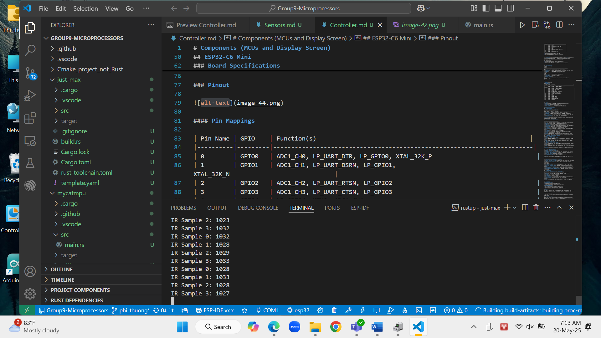

### Electrical Characteristics 
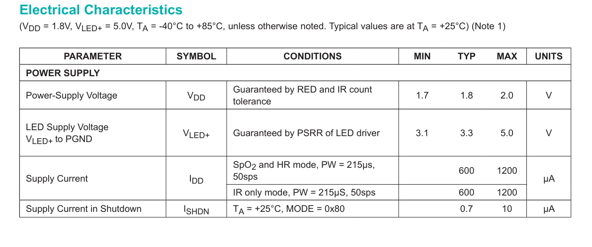
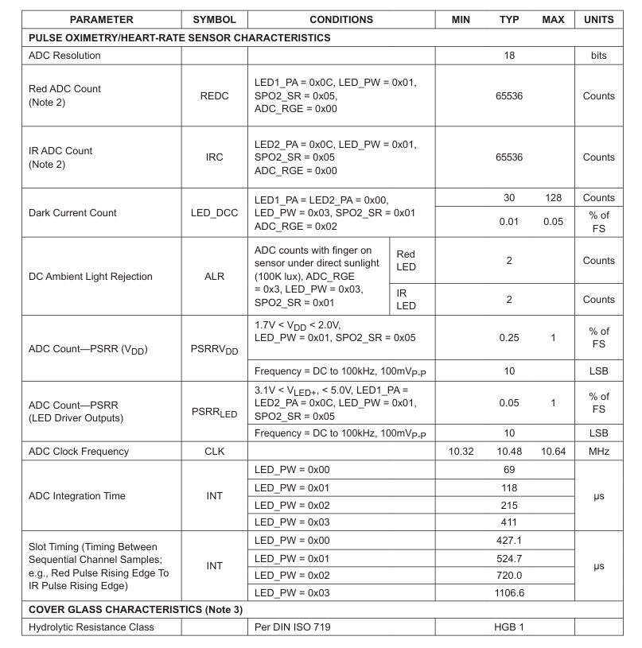
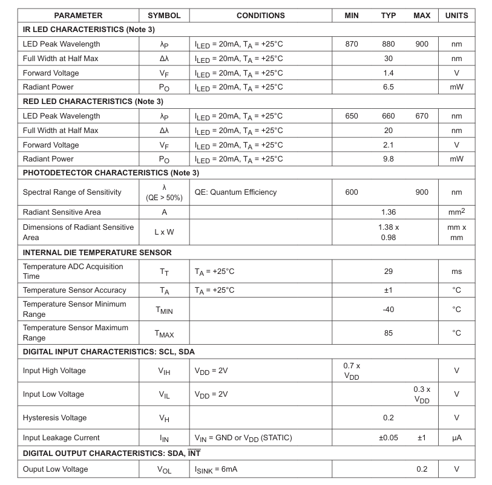
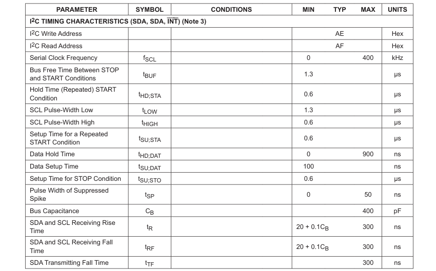

### Detailed I2C Compatible Interface Timing Tiagram 

- To understand it , read below 
## Understand the I2C Protocol
- The I2C protocol also known as the two wire interface is a simple serial communication protocol that uses just two pins of a microcontroller namely SCL (serial clock) and SDA (serial data). This is a very popular protocol that can be used to address a large number of slave devices that are connected to the same bus. This protocol comes in handy when there is scarcity of available pins in the microcontroller. Each slave device has a slave address or a name for which they respond. This is usually a 7-bit binary number. Once a master sends a valid slave address, that slave alone will respond to the master’s queries and all other slaves will ignore any conversation between the master and that particular slave.

- There are a number of conditions that can be made over the I2C bus such as start and stop sequence. The data line does not change when the clock line is HIGH. If the data line changes when the clock line is High, the slave device interprets it as a command and not as data. This is the only feature in the interface that puts a distinct line between the command and data.
### I2C General Protocol Timing Diagram
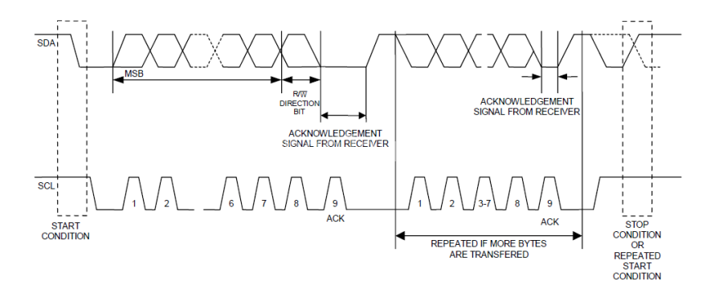
### Understanding the Start and Stop sequence of I2C Protocol
- The timing diagram above has the start sequence shown in the dotted box to the left. Here if you notice the data line SDA is having a High to Low transition when the clock line SCL is HIGH. Under normal circumstances this does not happen as you can see in the subsequent clock pulses that the data line is stable in one state, either HIGH or LOW when the clock line is HIGH. Similarly to the right most side of the diagram you will find another dotted box with the stop sequence (see the one with the solid line inside the box). The data line experiences a LOW to HIGH transition when the clock line is HIGH.

- Besides this there is also a “Repeated Start” condition which allows a master to continue the current transaction without losing atomicity. This is achieved by NOT sending a stop after the transaction but sending a Start in its place.

### Application
- The I2C protocol is quiet easy to understand. The working of the protocol is illustrated in the following content,

- The rule of thumb is that every time the slave devices experiences Start sequence it expects a 7-bit slave address along with a read/write specifier in the MSB (0 - for write and 1 - read). If the specifier is set to write then the next data written will be the address to the register to which the consecutive data is to be written. The device automatically increments the register pointer after a success full write. On the other hand if the specifier is set to read then the incoming data from the bus will return the value of the register to which the stack pointer was last pointing to and the consecutive registers following it.
### Sequentially write data to a slave device with I2C Protocol
- Here, the slave address with the write specifier is sent after the Start sequence. The slave sends an Acknowledge to the master (MCU). Then the next byte of data written to the slave device is the address of the register to write to. Following this there can be any number of sequential write operations with slave sending Acknowledge after every byte of data written to the register starting from the register specified by the address and sequentially moving up after each write operation. This can be terminated by sending a Stop sequence.

### Sequentially read data from a slave device with I2C Protocol
- Initially the slave address with the read specifier is sent after the Start sequence. The Slave sends an Acknowledge to the MCU. Following this there can be any number of sequential read operations with master(MCU) sending Acknowledge after every byte of data read from the register last written in the write operation (since, address of the register to read from is not specified here). This sequential read can be stopped by sending a Not Acknowledge signal followed by a Stop sequence

### Sequentially read and write data as a combination of the above two methods
- This process is just a mixture of both the sequential read and sequential write methods. Initially the slave address with the write specifier is sent after the Start sequence. Then the next data to be written will be the address of the register in the slave device over which the operation is going to be performed. Once this is done a repeated start sequence is made and and the 7-bit slave address with the read specifier is transmitted. Following this there can be any number of sequential reads from the register address specified in the previous step along with all the registers that follow it. The register address is automatically incremented by the device. The sequential read will involve the master (MCU) sending an Acknowledge to the slave after every byte of data read. The repeated read process can be stopped by sending a Not Acknowledge signal followed by a stop sequence.

### Using Oscilloscope to read I2C 
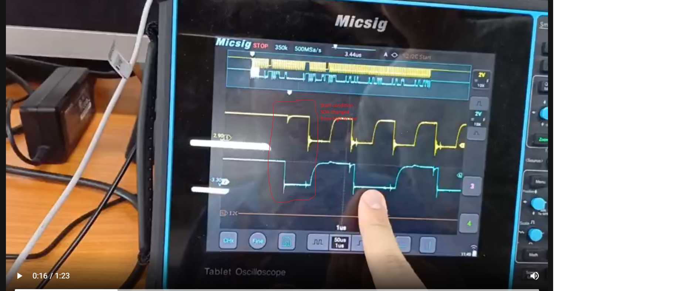
- The yellow line is the SCL signal , the blue line is the SDA signal
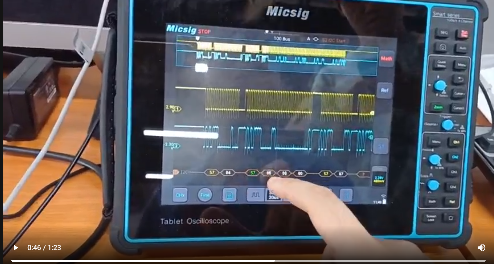
- 57 is the I2C address of MAX30102 , in hexadecimal form (in binary it is 1010111 - see correspondingly in the image)
- After that , SDA got 00 , it was the Write specifier and ACK signal . Then it wrote 0000100 to choose the address of the register 0x04 (FIFO Write Pointer)
- Then the sensor sent ACK to MCU to confirm , then the MCU send the sensor's address followed by bit 1 to access the sensor => convert to read mode : access register address 0x06 (FIFO Read Pointer)
- Finally , it read again 0x57 (I2C adress) and 0x07 (FIFO Data Register) and the sensor now started streaming data to the MCU .
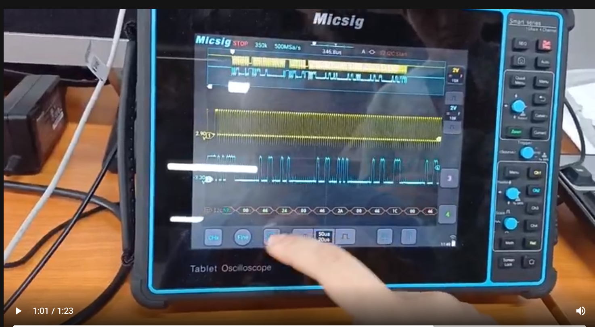
- Each result takes 4 bytes of data . 

## MPU6050 
### General Description 
- To understand how this sensor works , search for MEMS Accelerometer and MEMS gyroscope , Coriolis Effect
- A MEMS (Micro-Electro-Mechanical System) accelerometer is a micro-machined structure built on top of a silicon wafer.

  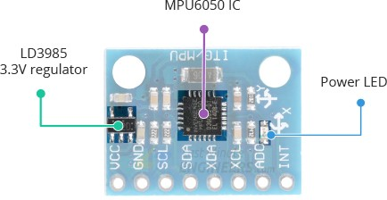
- At the core of the module is a low-power, low-cost 6-axis MotionTracking chip – MPU6050 – that integrates a 3-axis gyroscope, 3-axis accelerometer, and a Digital Motion Processor (DMP) into a tiny 4mm x 4mm package.
- It can measure angular momentum or rotation along all three axes, static acceleration caused by gravity, and dynamic acceleration caused by motion, shock, or vibration.
- The module includes an on-board LD3985 3.3V regulator, so you can safely use it with a 5V logic microcontroller
- The MPU6050 consumes less than 3.6mA during measurements and only 5μA when idle. Because of its low power consumption, it can be used in battery-powered devices.
- Additionally, the module has a Power LED that illuminates when the module is powered on.

### Measuring Acceleration 
- The MPU6050 has an on-chip accelerometer that can measure acceleration over four programmable full scale ranges of ±2g, ±4g, ±8g, and ±16g.
  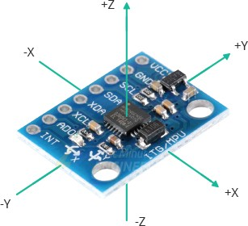
- The MPU6050 is equipped with three 16-bit analog-to-digital converters that simultaneously sample the three axes of movement (along the X, Y, and Z axes).

### Measuring Rotation 
- The MPU6050 has an on-chip gyroscope that can measure angular rotation over four programmable full scale ranges of ±250°/s, ±500°/s, ±1000°/s, and ±2000°/s.
  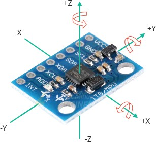
- The MPU6050 is equipped with three more 16-bit analog-to-digital converters that simultaneously sample the three axes of rotation (along the X, Y, and Z axes). The sampling rate can be adjusted from 3.9 to 8000 samples per second.

### Measuring Temperature
- The MPU6050 includes an embedded temperature sensor that can measure temperatures from -40 to 85°C with a ±1°C accuracy.

- Note that this temperature measurement is of the silicon die itself, not the ambient temperature. These measurements are typically used to compensate for accelerometer and gyroscope calibration or to detect temperature changes rather than measuring absolute temperatures.

### The I2C Interface
- The module communicates with the Arduino via the I2C interface. It supports two different I2C addresses: 0x68HEX and 0x69HEX. This allows two MPU6050s to be used on the same bus or to avoid address conflicts with other devices on the bus.

  

- The ADO pin determines the I2C address of the module. This pin is pulled down with a 4.7K resistor. Therefore, when you leave the ADO pin unconnected, the default I2C address is 0x68HEX; when you connect it to 3.3V, the line is pulled HIGH, and the I2C address becomes 0x69HEX.

### Adding External Sensors
- You can improve the accuracy of the MPU6050 module even further by connecting external sensors to it. These external sensors can be connected to the MPU6050 via a second, completely independent I2C bus (XDA and XCL).

  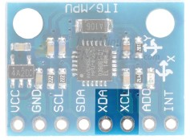

- This external connection is usually used to attach a magnetometer, which can measure magnetic fields along three axes. The MPU6050 has six Degrees of Freedom (DOF), three for the accelerometer and three for the gyroscope combined. The addition of a magnetometer increases the sensor’s degree of freedom from 6 to 9 DOF.

### Technical Specifications

| **Parameter**                    | **Specification**                        |
|----------------------------------|------------------------------------------|
| **Operating Voltage**            | 5V (typical)                              |
| **Accelerometer Range**         | ±2g, ±4g, ±8g, ±16g                      |
| **Gyroscope Range**             | ±250°/s, ±500°/s, ±1000°/s, ±2000°/s     |
| **Temperature Range**           | -40 to +85°C                             |
| **Absolute Maximum Acceleration** | Up to 10,000g                           |

### MPU6050 Module Pinout

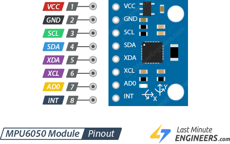

- VCC supplies power to the module.

- GND is the ground pin.

- SCL is a serial clock pin for the I2C interface.

- SDA is a serial data pin for the I2C interface.

- XDA is the external I2C data line. The external I2C bus is for connecting external sensors, such as a magnetometer.

- XCL is the external I2C clock line.

- AD0 allows you to change the I2C address of the MPU6050 module. It can be used to avoid conflicts between the module and other I2C devices or to connect two MPU6050s to the same I2C bus. When you leave the ADO pin unconnected, the default I2C address is 0x68HEX; when you connect it to 3.3V, the I2C address changes to 0x69HEX.

- INT is the Interrupt Output pin. The MPU6050 can be programmed to generate an interrupt upon detection of gestures, panning, zooming, scrolling, tap detection, and shake detection.

### Importance of Fall Detection Using MPU6050

#### 📌 Introduction

Falls are a major health risk, especially for elderly individuals and people with medical conditions such as epilepsy or Parkinson's disease. According to the World Health Organization, falls are the second leading cause of accidental injury deaths worldwide. Timely detection of a fall can make the difference between life and death by enabling faster emergency response.

#### 🤖 Why Use MPU6050?

The **MPU6050** is a widely used 6-axis MEMS sensor that combines a **3-axis gyroscope** and a **3-axis accelerometer** in a single chip. Its affordability, small size, and real-time performance make it an ideal choice for wearable fall detection systems.

##### Features That Make MPU6050 Suitable:

- **Accelerometer Range**: ±2g, ±4g, ±8g, ±16g  
- **Gyroscope Range**: ±250°/s, ±500°/s, ±1000°/s, ±2000°/s  
- **Operating Voltage**: 5V (typical)  
- **Temperature Range**: -40 to +85°C  
- **Absolute Maximum Acceleration**: Up to 10,000g  

These features allow the MPU6050 to accurately detect sudden changes in motion and orientation that are typical of a fall event.

#### ⚙️ How Fall Detection Works

Fall detection algorithms typically analyze:

- Sudden acceleration spikes
- Angle of tilt or orientation
- Lack of motion after the fall

Using the data from MPU6050:
- The **accelerometer** detects sudden impacts or high g-forces.
- The **gyroscope** tracks rotation and changes in body orientation.
- Algorithms can then determine whether a fall has occurred and trigger alerts.

#### 💡 Applications

- **Elderly care**: Alerts family members or caregivers in the event of a fall.
- **Health monitoring wearables**: Smartwatches and fitness trackers.
- **Industrial safety**: Detect accidents on job sites.
- **Sports injury prevention**: Real-time monitoring of high-impact sports.

#### 🧠 Conclusion

Fall detection is a vital application for modern healthcare and safety systems. With its low power consumption, accurate motion tracking, and low cost, the MPU6050 is a perfect sensor to implement such solutions. Leveraging this sensor can lead to the development of life-saving wearable technologies that enhance personal safety and well-being.

---

### Dependency used in Rust coding

- mpu6050 = "0.1.6"
- no_std driver for the MPU6050 6-axis IMU
Reading the accelerometer, gyroscope, temperature sensor
- raw
- scaled
- roll/pitch estimation
Motion Detection
Setting Accel/Gyro Ranges/Sensitivity
Setting Accel HPF/LPF

### Test Read Data of MPU6050 and try fall detecting
- Idea : If total acceleration and rotational angles changes suddenly and stable low (do not change rapidly and the value is very low ) for few seconds later => That's counted a fall , but if it is stable but continuously changing in a middle-high value => That's not a fall , that's just working or running or something , ...

Test case (Just read data) : 

Test case (Both read data and fall detection) :

### Electrical Characteristics

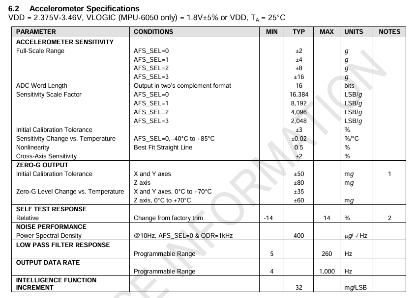
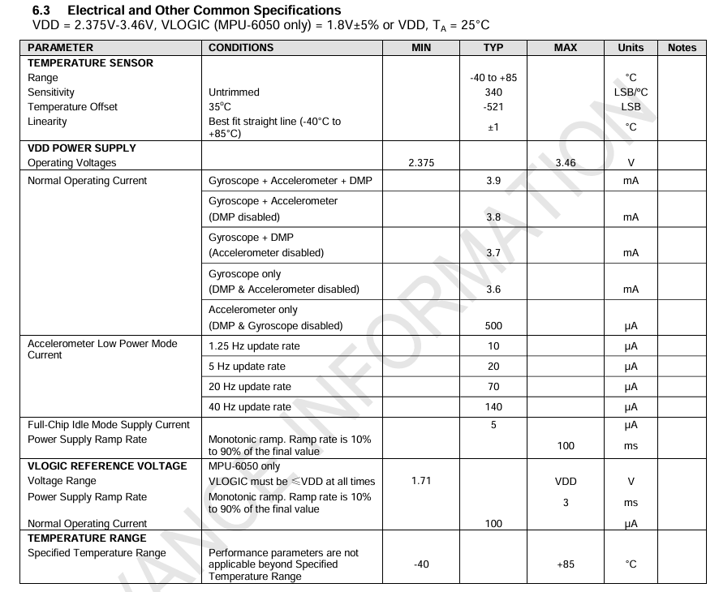
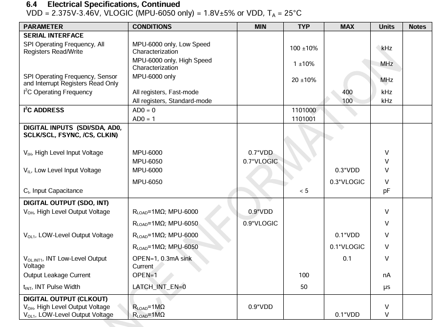
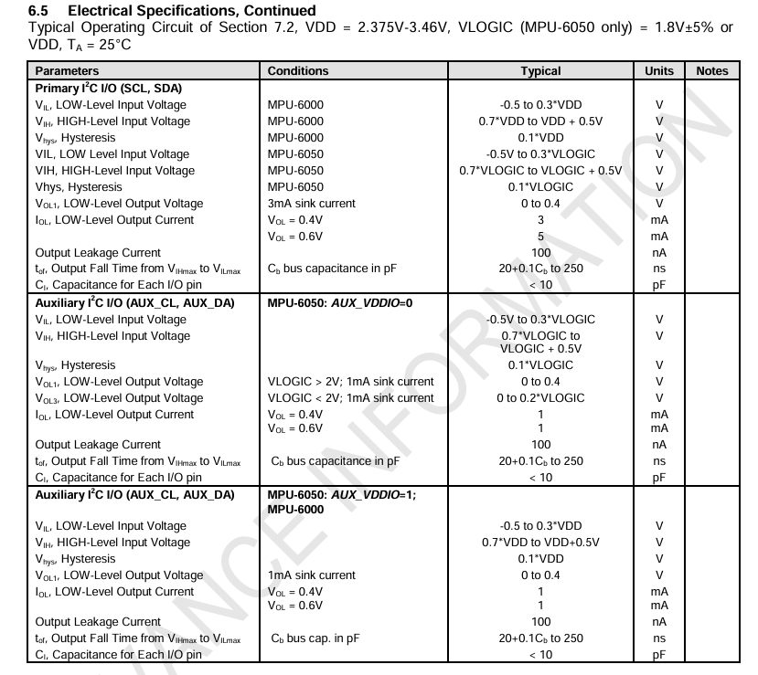
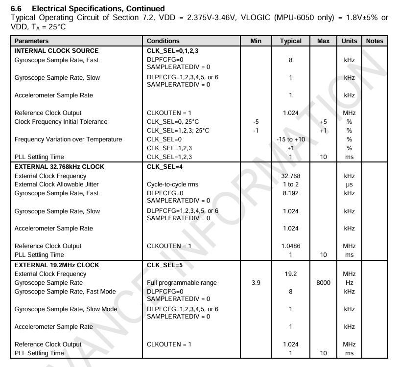

### Read I2C from Oscilloscope 
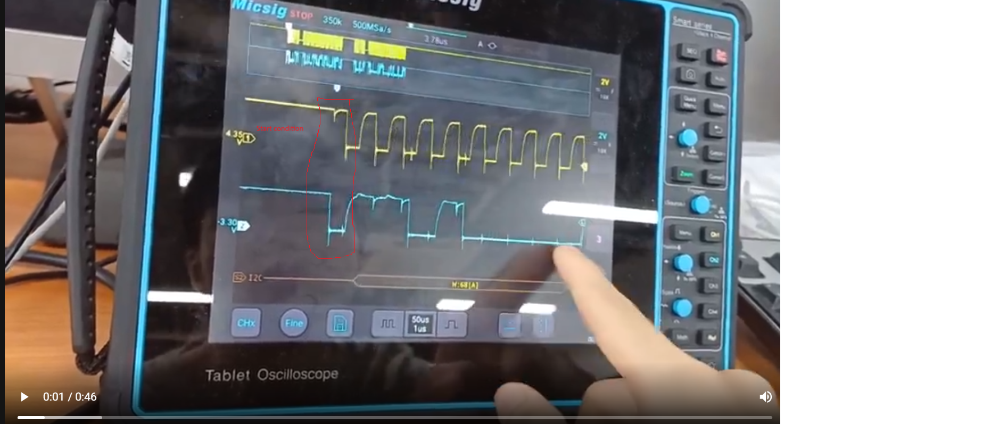
- The yellow line is the SCL signal , the blue line is the SDA signal
- After start condition , it followed by 1101000 = 0x68 in hexadecimal form (I2C address of MPU6050) 
- After that , SDA got 00 , it was the Write specifier and ACK signal . Then it wrote 00111011 to choose the address of the register 0x3B (FIFO Write Pointer)
- Then the sensor sent ACK to MCU to confirm , then the MCU send the sensor's address followed by bit 1 to access the sensor => convert to read mode : access register address 0x43 (FIFO Read Pointer)
- Finally , it sent an ACK signal then started streaming data to MCU . 
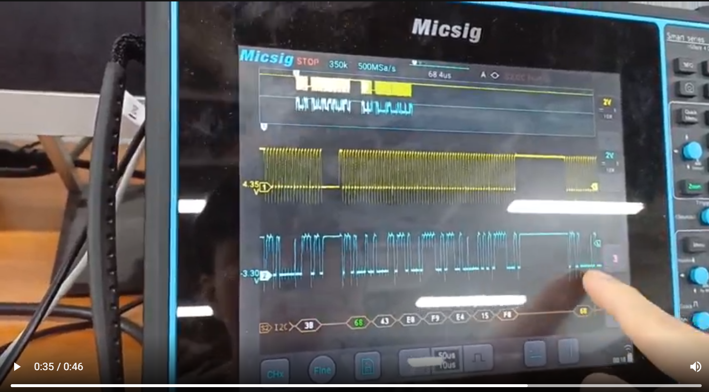
- After access register address 0x43 and sent ACK clock

