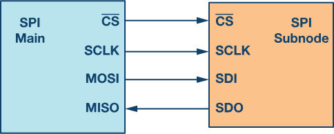
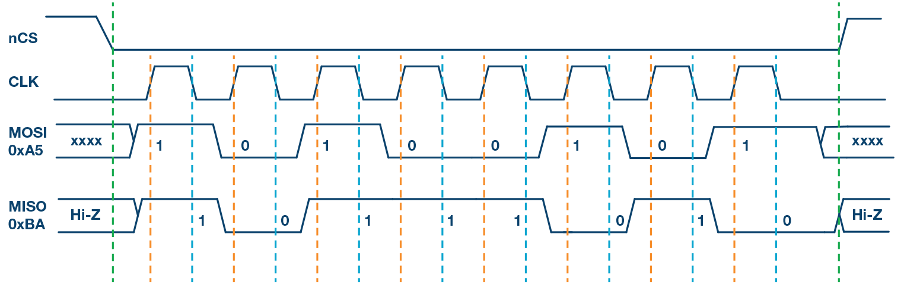
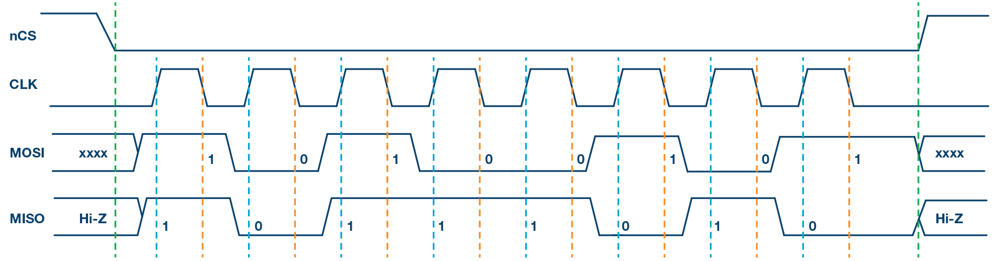
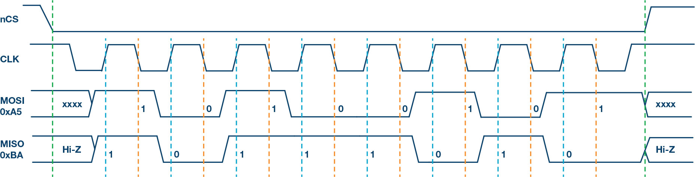
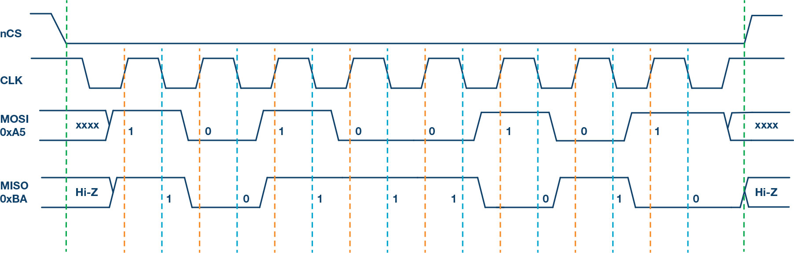
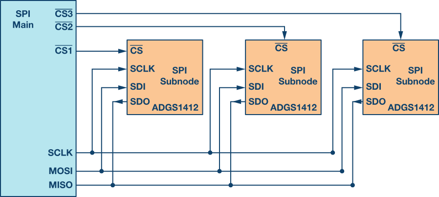
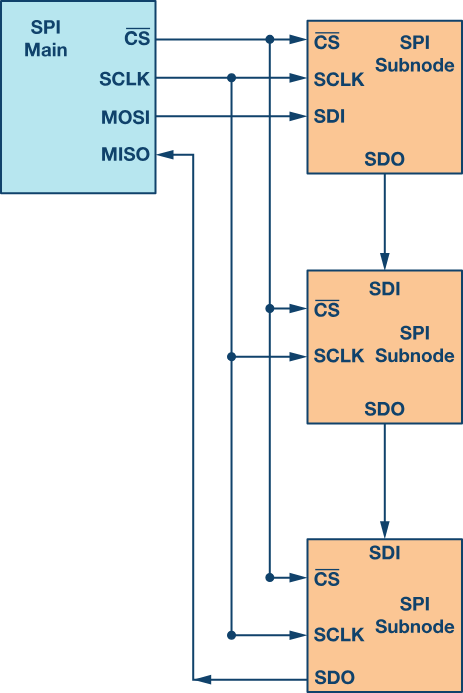
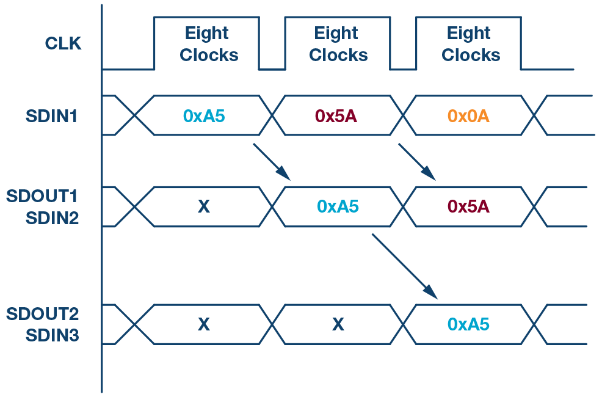
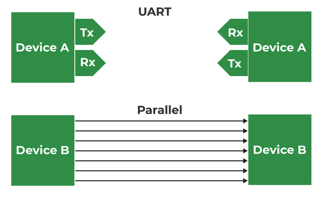
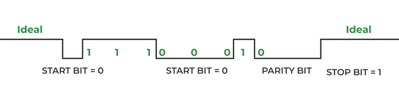

# Introduction to SPI Interface
Serial peripheral interface (SPI) is one of the most widely used interfaces between microcontroller and peripheral ICs such as sensors, ADCs, DACs, shift registers, SRAM, and others. This article provides a brief description of the SPI interface followed by an introduction to Analog Devices’ SPI enabled switches and muxes, and how they help reduce the number of digital GPIOs in system board design.

SPI is a synchronous, full duplex main-subnode-based interface. The data from the main or the subnode is synchronized on the rising or falling clock edge. Both main and subnode can transmit data at the same time. The SPI interface can be either 3-wire or 4-wire. This article focuses on the popular 4-wire SPI interface

## Interface

4-wire SPI devices have four signals:

- Clock (SPI CLK, SCLK)
- Chip select (CS)
- main out, subnode in (MOSI)
- main in, subnode out (MISO)

The device that generates the clock signal is called the main. Data transmitted between the main and the subnode is synchronized to the clock generated by the main. SPI devices support much higher clock frequencies compared to I2C interfaces. Users should consult the product data sheet for the clock frequency specification of the SPI interface.

SPI interfaces can have only one main and can have one or multiple subnodes. Figure 1 shows the SPI connection between the main and the subnode.

The chip select signal from the main is used to select the subnode. This is normally an active low signal and is pulled high to disconnect the subnode from the SPI bus. When multiple subnodes are used, an individual chip select signal for each subnode is required from the main. In this article, the chip select signal is always an active low signal.

MOSI and MISO are the data lines. MOSI transmits data from the main to the subnode and MISO transmits data from the subnode to the main.

## Data Transmission
To begin SPI communication, the main must send the clock signal and select the subnode by enabling the CS signal. Usually chip select is an active low signal; hence, the main must send a logic 0 on this signal to select the subnode. SPI is a full-duplex interface; both main and subnode can send data at the same time via the MOSI and MISO lines respectively. During SPI communication, the data is simultaneously transmitted (shifted out serially onto the MOSI/SDO bus) and received (the data on the bus (MISO/SDI) is sampled or read in). The serial clock edge synchronizes the shifting and sampling of the data. The SPI interface provides the user with flexibility to select the rising or falling edge of the clock to sample and/or shift the data. Please refer to the device data sheet to determine the number of data bits transmitted using the SPI interface.

## Clock Polarity and Clock Phase
In SPI, the main can select the clock polarity and clock phase. The CPOL bit sets the polarity of the clock signal during the idle state. The idle state is defined as the period when CS is high and transitioning to low at the start of the transmission and when CS is low and transitioning to high at the end of the transmission. The CPHA bit selects the clock phase. Depending on the CPHA bit, the rising or falling clock edge is used to sample and/or shift the data. The main must select the clock polarity and clock phase, as per the requirement of the subnode. Depending on the CPOL and CPHA bit selection, four SPI modes are available. Table 1 shows the four SPI modes.

### Table 1. SPI Modes with CPOL and CPHA

| SPI Mode | CPOL | CPHA | Clock Polarity in Idle State | Clock Phase Used to Sample and/or Shift the Data                                     |
|----------|------|------|-------------------------------|----------------------------------------------------------------------------------------|
| 0        | 0    | 0    | Logic low                     | Data sampled on rising edge and shifted out on the falling edge                       |
| 1        | 0    | 1    | Logic low                     | Data sampled on the falling edge and shifted out on the rising edge                   |
| 2        | 1    | 0    | Logic high                    | Data sampled on the falling edge and shifted out on the rising edge                   |
| 3        | 1    | 1    | Logic high                    | Data sampled on the rising edge and shifted out on the falling edge                   |

Figure 2 through Figure 5 show an example of communication in four SPI modes. In these examples, the data is shown on the MOSI and MISO line. The start and end of transmission is indicated by the dotted green line, the sampling edge is indicated in orange, and the shifting edge is indicated in blue. Please note these figures are for illustration purpose only. For successful SPI communications, users must refer to the product data sheet and ensure that the timing specifications for the part are met.

Figure 3 shows the timing diagram for SPI Mode 1. In this mode, clock polarity is 0, which indicates that the idle state of the clock signal is low. The clock phase in this mode is 1, which indicates that the data is sampled on the falling edge (shown by the orange dotted line) and the data is shifted on the rising edge (shown by the dotted blue line) of the clock signal.

Figure 4 shows the timing diagram for SPI Mode 2. In this mode, the clock polarity is 1, which indicates that the idle state of the clock signal is high. The clock phase in this mode is 0, which indicates that the data is sampled on the falling edge (shown by the orange dotted line) and the data is shifted on the rising edge (shown by the dotted blue line) of the clock signal.

Figure 5 shows the timing diagram for SPI Mode 3. In this mode, the clock polarity is 1, which indicates that the idle state of the clock signal is high. The clock phase in this mode is 1, which indicates that the data is sampled on the rising edge (shown by the orange dotted line) and the data is shifted on the falling edge (shown by the dotted blue line) of the clock signal

## Multi-Subnode Configuration

Multiple subnodes can be used with a single SPI main. The subnodes can be connected in regular mode or daisy-chain mode.

Regular SPI Mode : 

In regular mode, an individual chip select for each subnode is required from the main. Once the chip select signal is enabled (pulled low) by the main, the clock and data on the MOSI/MISO lines are available for the selected subnode. If multiple chip select signals are enabled, the data on the MISO line is corrupted, as there is no way for the main to identify which subnode is transmitting the data.

As can be seen from Figure 6, as the number of subnodes increases, the number of chip select lines from the main increases. This can quickly add to the number of inputs and outputs needed from the main and limit the number of subnodes that can be used. There are different techniques that can be used to increase the number of subnodes in regular mode; for example, using a mux to generate a chip select signal.

Daisy-Chain Method: 

In daisy-chain mode, the subnodes are configured such that the chip select signal for all subnodes is tied together and data propagates from one subnode to the next. In this configuration, all subnodes receive the same SPI clock at the same time. The data from the main is directly connected to the first subnode and that subnode provides data to the next subnode and so on.

In this method, as data is propagated from one subnode to the next, the number of clock cycles required to transmit data is proportional to the subnode position in the daisy chain. For example, in Figure 7, in an 8-bit system, 24 clock pulses are required for the data to be available on the 3rd subnode, compared to only eight clock pulses in regular SPI mode. Figure 8 shows the clock cycles and data propagating through the daisy chain. Daisy-chain mode is not necessarily supported by all SPI devices. Please refer to the product data sheet to confirm if daisy chain is available.

# Universal Asynchronous Receiver Transmitter (UART) Protocol

UART means Universal Asynchronous Receiver Transmitter Protocol. UART is used for serial communication from the name itself we can understand the functions of UART, where U stands for Universal which means this protocol can be applied to any transmitter and receiver, and A is for Asynchronous which means one cannot use clock signal for communication of data and R and T refers to Receiver and Transmitter hence UART refers to a protocol in which serial data communication will happen without clock signal. 

UART is established for serial communication. In this article, we will discuss how parallel communication is established with respect to serial communication using UART as well as how to configure UART and what is the data format in UART. Later on, we will discuss the Pros and Cons of the UART. 

## UART Basics

UART is a Universal Asynchronous Receiver Transmitter protocol that is used for serial communication. Two wires are established here in which only one wire is used for transmission whereas the second wire is used for reception. Data format and transmission speeds can be configured here. So, before starting with the communication define the data format and transmission speed. Data format and transmission speed for communication will be defined here and we do not have a clock over here that's why it is referred to as asynchronous communication with UART protocol. Here we will see how this protocol is designed physically.

Here, DEVICE A that is having transmitter PIN and a receiver pin; DEVICE B is having a receiver and transmission pin. The Transmitter of DEVICE A is one that should be connected with the receiver pin of DEVICE B and the transmitter pin of DEVICE B should be connected with the receiver pin of DEVICE A we just need to connect two wires for communication. 

If DEVICE A wants to send data, then it will be sending data on the transmitter’s pin and here receiver of this DEVICE B will receive it over and if DEVICE A wants to receive the data, then that is possible on the RX line that will be forwarded by TX of DEVICE B. On comparing this serial communication of UART with parallel then it can be observed that in parallel multiple buses are required. Based on the number of lines bus complexity of UART is better but parallel communication is good in terms of speed. 

So, when speed is required at that time we should select parallel communication and for a low-speed application, UART must be used and the bus complexity will be less. 

The configuration of UART is done before transmission, both of these devices are connected with protocol and should know the speed of data transmission. First, define the speed of both devices. Now, configure the speed of DEVICE A and B for data transmission which is referred to as Baud Rate so here Baud Rate will be the same for DEVICE A and B otherwise both of these devices cannot understand at what speed and at what rate data is coming. After that, configure the data length so here DEVICE A and DEVICE B both are configured at fixed data length if DEVICE A is transmitting data, then it is configured with fixed data. Like if DEVICE A is configured with the eight-bit size of data then DEVICE B should also be configured at the same size of data which is eight bits. After this, check data transmission or receiving time, forward start bits, and stop bits.

Now we will see the data format and when the communication is according to UART protocol. We are using NRZ encoding for data communication.

## UART Data Format

Suppose DEVICE A is sending data to DEVICE B, and the transmitter of DEVICE A will send data to the receiver of Device B then it will be logic high. Now, send the start bit that will be logic 0 and once we have the start bit, DEVICE B will know that somebody is communicating. Now there is the same speed configuration with both devices. So, after the start bit, DEVICE A can forward data.

Consider 8 bits of data length, so we will be forwarding 8 bits and those 8 bits will be received by DEVICE B a parity bit can also be used which is optional, but this is quite effective. By using the parity bit, it can be identified whether the received data is correct or not. Suppose we are sending 1 1 1 0 0 0 1 0. Now, we have 4 ones; an even number of ones are there hence the parity is even and for that, logic 0 will be assigned. Suppose we are receiving data with some error, say zero is converted into one; Now incorrect data that is 1 1 1 1 0 0 1 0 for this incorrect data parity will be 0 as there are 5 ones, here is a mismatch in the parity bit and hence it is confirmed that the received data has some error. 

## Pros of UART Protocol

- It is having less physical interfacing based on only two lines.  
- Simple to configure data and data size. Speed is also configurable. In the majority of cases, this baud rate is 9600 for the UART protocol. Full duplex mode configuration is possible by using two wires so that is the major advantage of UART. 
- Error detention is possible

## Cons of UART Protocol

- UART is having serial communication, therefore, it has less speed.
- Start bit, stop bit, and the parity bit is other overhead.  
- Since this is asynchronous communication so here there are many things that we need to do in configuration, for instance, we should configure both devices at the same speed because the clock signal is absent.
